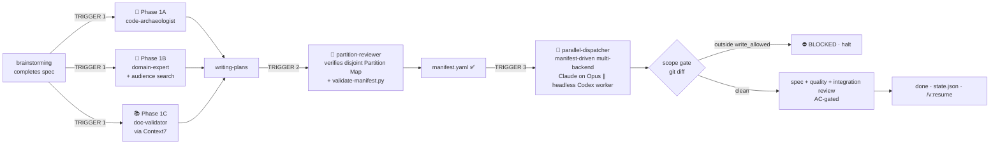

# superpowers-v 💉

**Compound V** — a sidekick to [Superpowers](https://github.com/obra/superpowers).

[](LICENSE)
[](https://docs.claude.com/en/docs/claude-code/plugins)
[](#multi-harness-compatibility)
[](skills/compound-v/phase-3-parallel-opus-dispatch.md)

> *"You don't tell people you're injecting them with Compound V. You just hand them the spec and watch them ship."*


You keep using **Superpowers** the way you already do. Compound V silently shows up at the three phase transitions and does the work that would otherwise burn your day:

- It **measures the building** before you design the addition (code-archaeology)
- It **reads the building code** — including what real users on r/whatever say breaks for them (domain-expert with audience search)
- It **checks every library** against current docs so you don't pin yesterday's `oauth2orize` (Context7 library validator)
- It **partitions the plan** into non-overlapping file sets so implementers can't collide
- It **dispatches them in parallel on Opus** instead of one-at-a-time on a cheap model

As of **v1.0**, the tail of that flow is a real **execution orchestrator**: it materializes a machine-readable `manifest.yaml` of file-scoped jobs, routes each to its backend (Claude subagent or a headless **Codex** worker), **enforces** with a `git diff` scope gate that no worker wrote outside its allowed files, collects canonical `job_result`s, reviews against the spec's Acceptance Criteria, and is **crash-resumable** via `state.json`. No daemon, no MCP server, no fabricated metrics.

Backend failures are handled **gracefully**: a non-success job is classified (by error type, not HTTP status) and routed through a deterministic policy — retry transient errors with backoff, **circuit-break + re-route codex→claude on out-of-credits**, escalate tier on context-length, halt on auth — all resumable and **loudly reported** (never a silent cheap→expensive swap). See [skills/compound-v/failure-policy.md](skills/compound-v/failure-policy.md).

Routing is **tier-based and churn-proof**: jobs declare a `tier` (`deep`/`standard`/`light`) and an optional `effort` (`low`/`medium`/`high`) instead of a hardcoded model name. A resolver (`scripts/compound-v-resolve-model.py`) maps tier → concrete model through a refreshable config `models` map, so when models change you update one map (or run `/v:models`) instead of editing prompts. Codex's reasoning-effort is exposed as `--effort`.

You don't invoke Compound V. It invokes itself.

---

## 1 · 2 · 3 — install in three steps

### 1. Install the plugin

In Claude Code:

```
/plugin marketplace add https://github.com/procoders/superpowers-v
/plugin install superpowers-v@procoders
```

That's it. For local development setups (clone-and-edit or `--plugin-dir` live-reload mode), see the **Development** section below.

### 2. Use Superpowers normally

That's it. Open a session, brainstorm a feature, and watch Compound V appear at the right moments. The SessionStart hook prints a banner so you know it's loaded.

### 3. (Recommended) Add Context7 MCP for Phase 1C

Phase 1C (library/doc validator) uses Context7 MCP for live documentation lookups. It's recommended but not required — without it Phase 1C falls back to WebSearch (slower, less authoritative).

The simplest path is via the official Anthropic plugin marketplace:
```
/plugin install context7@claude-plugins-official
```

Or add it manually to your `~/.claude.json` (or project `.mcp.json`):
```json
{
  "mcpServers": {
    "context7": {
      "command": "npx",
      "args": ["-y", "@upstash/context7-mcp"]
    }
  }
}
```

Verify it's loaded: `/mcp` should show `context7` connected.

---

## What it does (the skyscraper metaphor)

Customer asks for 500m² more space on a 200m² tower.

- **Default Superpowers:** agent staples one 500m² floor on top — an ugly hat, half hanging in air. Ships fast, breaks later.
- **Compound V:** agent runs three audits in parallel (the building is 200m², the building code limits cantilever to 15%, and oauth2orize was abandoned in 2022 so use `@node-oauth/oauth2-server` instead). Proposes three 200m² floors. Customer wanted 500m², gets **600m²** that passes inspection.

See [assets/skyscraper-metaphor.md](assets/skyscraper-metaphor.md) for the comic + technical diagram.

---

## The three phases (auto-fired)



**Trigger 1** (after brainstorming): three pre-flights dispatched in ONE message with three concurrent Task calls.

**Trigger 2** (inside writing-plans): the plan declares a Partition Map and **materializes a `manifest.yaml`**; `partition-reviewer` checks it for file-overlap, missed shared resources, and unjustified Sonnet assignments, backed by the deterministic `compound-v-validate-manifest.py` gate. For **high-stakes** plans (security/auth/payments/migrations, a large/coupled partition, or an architectural change), the orchestrator can additionally run an **optional independent Codex second opinion** before dispatch (`/v:review-plan`) — read-only and advisory, the orchestrator arbitrates each finding.

**Trigger 3** (at execution): `parallel-dispatcher` runs Task 0 serially, then dispatches the manifest's parallel batches (4-6 per message) across backends — Claude on Opus by default, Sonnet only where justified, a headless **Codex** worker for large isolated builds. After **every** job a `git diff` scope gate checks the worker stayed inside its `write_allowed` list; a violation is **BLOCKED** and never merges. The run records progress in `state.json` so it survives a crash (`/v:resume`).

---

## What's in this plugin

```
superpowers-v/
├── .claude-plugin/
│   ├── plugin.json                            # version 1.0.0; keywords += orchestrator
│   └── marketplace.json                       # local-dev convenience (kept in lockstep)
├── agents/                                    # 6 first-class subagent definitions
│   ├── code-archaeologist.md                  # → subagent_type: "compound-v:code-archaeologist"
│   ├── domain-expert.md                       # → subagent_type: "compound-v:domain-expert"
│   ├── doc-validator.md                       # → subagent_type: "compound-v:doc-validator"
│   ├── partition-reviewer.md                  # disjointness + validate-manifest.py gate
│   ├── parallel-dispatcher.md                 # manifest-driven multi-backend dispatch + scope gate
│   └── spec-reviewer.md                       # 3-pass review gate (spec · quality · integration)
├── commands/                                  # opt-in slash commands (auto-fire is primary)
│   ├── v-init.md                              # /v:init — detect capabilities, set routing stance
│   ├── v-orchestrate.md                       # /v:orchestrate <plan> — materialize a manifest
│   ├── v-dispatch.md                          # /v:dispatch <plan|manifest|run-id> — run the pipeline
│   ├── v-collect.md                           # /v:collect <run-id> — re-run collect + gate + review
│   ├── v-status.md                            # /v:status [run-id] — render state.json
│   ├── v-resume.md                            # /v:resume <run-id> — re-dispatch incomplete jobs
│   ├── v-models.md                            # /v:models — discover models, assign tier→model, write config map
│   └── v-archaeology.md                       # /v:archaeology <topic> — Phase 1A alone (unchanged)
├── hooks/                                     # sidekick reminders (description-based auto-fire is primary)
│   ├── hooks.json                             # SessionStart + PostToolUse(Write)
│   ├── session-banner.sh                      # SessionStart: banner + /v:init hint when no config
│   └── plan-saved-nudge.sh                    # PostToolUse(Write): nudge toward /v:orchestrate or /v:dispatch
├── skills/
│   ├── compound-v/                            # main skill — orchestrator-as-default
│   │   ├── SKILL.md                           # main entry, auto-fires at transitions
│   │   ├── phase-1a-archaeology.md            # 🔬 technical pre-flight (code reality)
│   │   ├── phase-1b-domain-expert.md          # 🧠 domain pre-flight (product reality + audience)
│   │   ├── phase-1c-documentation-validation.md # 📚 library pre-flight (Context7)
│   │   ├── domain-expert-prompt.md            # advisor dispatch template (fallback)
│   │   ├── doc-validator-prompt.md            # validator dispatch template (fallback)
│   │   ├── phase-2-disjoint-partitioning.md   # 🧩 partition-map planning → emits manifest.yaml
│   │   ├── phase-3-parallel-opus-dispatch.md  # 🚀 manifest-driven multi-backend dispatch + taxonomy
│   │   ├── execution-manifest.md              # manifest schema + rules
│   │   ├── routing-policy.md                  # task-type → (tier, effort); stances + env-aware + models map
│   │   ├── failure-policy.md                  # backend-failure classify → retry/reroute/halt + circuit breaker
│   │   ├── state-machine.md                   # states + run dir + crash-resume
│   │   ├── skill-escalation.md                # gated deep-research / playground / writing-style
│   │   ├── workflows-accelerator.md           # opt-in Engine C fast-path (probe + fallback to A)
│   │   └── rationalization-table.md           # rebuttals to every "just this once" excuse
│   └── backend-launcher/                      # sub-skill: one job_spec → job_result contract
│       ├── SKILL.md                           # the contract every adapter implements
│       ├── adapter-claude.md                  # Task-based dispatch (Opus/Sonnet)
│       ├── adapter-codex.md                   # headless `codex exec` + worktree + git diff
│       └── adapter-antigravity.md             # stub returning `unsupported` (deferred to 1.1)
├── scripts/                                   # small deterministic helpers (bash 3.2 / python 3.9, stdlib)
│   ├── compound-v-scope-check.py              # git-diff scope gate (the SCOPE LOCK authority)
│   ├── compound-v-resolve-model.py            # tier (+effort) → concrete model via config models map
│   ├── compound-v-validate-manifest.py        # deterministic manifest-invariant gate
│   ├── compound-v-run-codex-worker.sh         # headless Codex worker (worktree + diff + normalize)
│   ├── compound-v-collect-results.py          # normalize heterogeneous output → job_result
│   ├── compound-v-update-memory.py            # append task-outcomes.jsonl
│   └── lint-frontmatter.py                    # frontmatter linter (no-Haiku policy)
├── schemas/
│   └── job_result.schema.json                 # strict JSON Schema; codex --output-schema target
├── examples/                                  # committed fixtures CI validates against
│   ├── manifest.example.yaml
│   └── job_result.example.json
├── docs/superpowers/memory/
│   └── routing-lessons.md                     # human-curated routing memory seed
├── assets/
│   ├── compound-v-cover.png
│   └── skyscraper-metaphor.md                 # comic + technical diagram
├── evals/
│   └── evals.json                             # skill-trigger eval cases
├── .github/workflows/
│   └── validate.yml                           # CI: schema, frontmatter, manifest, dead links, shellcheck
├── AGENTS.md                                  # Codex / generic-harness shim (🧪 untested)
├── GEMINI.md                                  # Gemini CLI shim (🧪 untested)
├── CHANGELOG.md
├── TROUBLESHOOTING.md
├── README.md
└── LICENSE
```

---

## Multi-harness compatibility

| Harness | Status | Entry point |
|---|---|---|
| **Claude Code** | ✅ primary target | `.claude-plugin/plugin.json` |
| **Codex CLI** | 🧪 untested shim — needs hands-on verification | [AGENTS.md](AGENTS.md) |
| **Gemini CLI** | 🧪 untested shim — schema may need adaptation | [GEMINI.md](GEMINI.md) |

The skill content is harness-neutral prose. Tool names differ across harnesses — the shims document the mapping.

---

## Model policy

- **Opus by default** — every implementer, reviewer, advisor
- **Sonnet** — narrow exception per the strict **8-box junior-task taxonomy** in [phase-3](skills/compound-v/phase-3-parallel-opus-dispatch.md). Every Sonnet-assigned task needs a one-line justification in the Partition Map.
- **Never Haiku** — not permitted in this project, even for read-only Explore-style work

Under the hood these map through the **tier** vocabulary: the Claude `deep`/`standard` tiers resolve to `opus`, `light` resolves to `sonnet`, and no tier ever resolves to `haiku`. Jobs route by tier, not by a literal model name, so a model rename is a one-line config edit (or `/v:models`) rather than a prompt rewrite.

The trade: Opus + parallel dispatch is more expensive per-task than default Superpowers. But wall-clock time for N parallel tasks ≈ the slowest task, domain blowups get caught before they're code, and the persistent knowledge bases make every subsequent feature in the same domain progressively cheaper.

---

## Output convention

Compound V writes to a flat, predictable structure under `docs/superpowers/`:

```
docs/superpowers/
├── archaeology/                    # Phase 1A output (per feature)
│   └── YYYY-MM-DD-<topic>.md
├── expert/                         # Phase 1B output + persistent domain KB
│   ├── YYYY-MM-DD-<topic>.md
│   └── _knowledge-base/
│       └── <domain>.md
├── library-audit/                  # Phase 1C output + persistent library KB
│   ├── YYYY-MM-DD-<topic>.md
│   └── _knowledge-base/
│       └── <topic>.md
├── specs/                          # default Superpowers
└── plans/                          # default Superpowers
```

The `_knowledge-base/` subdirectories make each subsequent feature in the same domain or touching the same library cheaper — advisors read these first before running new web searches.

---

## When NOT to use

- Greenfield single-file features (no prior code to audit)
- Pure refactors that touch every file (partitioning impossible)
- Pure plumbing with no user-facing surface (build config, lint rules)
- Exploratory spikes without a spec
- Solo learning / sandbox

Fall back to default Superpowers in those cases — and document why in the plan header.

---

## Slash commands (opt-in)

Most users never need these — the sidekick flows through orchestrate → dispatch → collect on its own. The explicit commands are for manual control, resume, and inspection:

| Command | What it does |
|---|---|
| `/v:init` | Detect capabilities (Codex CLI, Context7 MCP), walk through installs, set + save the routing stance |
| `/v:orchestrate <plan>` | Materialize a `manifest.yaml` + initial `state.json` from a plan path + routing policy |
| `/v:dispatch <plan\|manifest\|run-id>` | Run the autonomous pipeline (partition-review → dispatch → scope-gate → collect → review). A bare plan path still works (backward-compatible) |
| `/v:collect <run-id>` | Re-run collect + scope-gate + review on an existing run |
| `/v:status [run-id]` | Render `state.json` — phase + per-job status |
| `/v:resume <run-id>` | Reconcile against git reality and re-dispatch only incomplete jobs after an interruption |
| `/v:models` | Discover available models per backend (`agy models`, curated Codex list, native Claude tiers), assign tier→model, and write the `models` map into `.claude/compound-v.json` |
| `/v:review-plan <plan>` | Run an optional **cross-model (Codex) second opinion** on a high-stakes plan before dispatch — read-only, advisory; the orchestrator arbitrates each finding |

Plus the unchanged Phase 1A shortcut:

| Command | What it does |
|---|---|
| `/v:archaeology <topic>` | Run Phase 1A alone (code-archaeology audit) |

Run `/v:init` once per machine/repo to detect Codex and Context7 and pick a routing stance (Balanced when Codex is present, Claude-only when it isn't).

---

## Development

If you're hacking on the plugin itself (adding agents, tweaking prompts):

```bash
git clone https://github.com/procoders/superpowers-v.git
cd superpowers-v

# Live-edit mode — edits in the cloned dir are picked up by /reload-plugins
claude --plugin-dir "$PWD"
```

Inside the session, after editing files:
```
/reload-plugins
```

Alternatively, install from the local clone via the same marketplace pattern:
```
/plugin marketplace add /absolute/path/to/superpowers-v
/plugin install superpowers-v@procoders
```

Before opening a PR, run the linters locally:
```bash
python3 scripts/lint-frontmatter.py .
# Optional cross-check (community linter):
npx -y @felixgeelhaar/cclint lint skills/compound-v/SKILL.md
```

---

## Troubleshooting

See [TROUBLESHOOTING.md](TROUBLESHOOTING.md) — covers auto-fire issues, Context7 unavailability, partition violations, rate-limits, and Codex/Gemini gotchas.

---

## Contributing

PRs welcome. CI runs on every push:
- `plugin.json` / `marketplace.json` / `hooks.json` / `job_result.schema.json` schema validation
- Agent frontmatter check (must have `name`, `description`; **must NOT specify Haiku**)
- Skill frontmatter check
- `compound-v-validate-manifest.py` against `examples/manifest.example.yaml` (disjoint writes, Codex⇒worktree, reviewers⇒Opus)
- Collector schema-conformance against `examples/job_result.example.json`
- No-fabricated-cost-metric grep gate (scripts + docs)
- Dead intra-plugin `.md` link check
- Hook + helper script executability + `shellcheck`

See [.github/workflows/validate.yml](.github/workflows/validate.yml).

---

## License

MIT. See [LICENSE](LICENSE).
