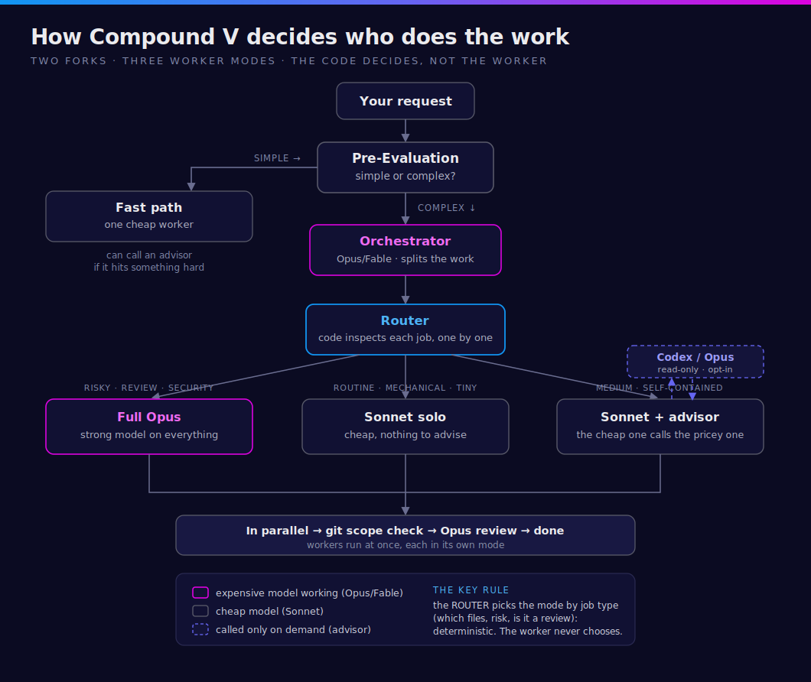

# superpowers-v 💉

**Compound V** — a multi-model coding sidekick for [Superpowers](https://github.com/obra/superpowers), running on Claude Code.

> *"You don't tell people you're injecting them with Compound V. You just hand them the spec and watch them ship."*


You describe a feature. Claude plans it, splits it into non-overlapping pieces, and hands the implementation out across **Claude / Codex / Antigravity / Cursor** — each working in its own isolated sandbox. Then it reviews the result (including a second opinion from a different model) before merging. You don't press a "start" button — it kicks in on its own as you work.

---

## 🎮 New here? Learn it as a game → **[Compound V Academy](https://amiainative.dev/compound-v)**

The fastest way to *get* what this plugin does. Three gamified episodes — **Developer · Product Owner · Universal Creator** — walk you through the whole pipeline (onboarding → the three scouts → manifest + dispatch → the review gates), with the squad — **The Trench**, **Bootcher**, **Monsieur Contexte**, **Motherboard**, **Git Noir**, **A-Express** — as your guides. 👉 **<https://amiainative.dev/compound-v>**

[](https://amiainative.dev/compound-v)

📄 Prefer a quick reference? The **[Compound V Cheatsheet](https://amiainative.dev/compound-v/cheatsheet)** puts the whole 8-phase pipeline, commands, skill triggers, memory, and backend-routing rules on one page.

---

## Main features

- **Multi-model orchestration** — Claude builds the plan and routes implementation jobs to the right backend (**Claude / Codex / Antigravity / Cursor**). Each worker runs isolated under a scope check, so nothing writes outside the files it was given.

- **Cross-model (Codex) review** — a second opinion on the plan **and** the code. Different models have different blind spots, so it's very good at catching planning gaps and mistakes. Advisory — the orchestrator makes the final call.

- **Epic mode** — feed it a whole PRD with many tasks and it builds feature by feature, in dependency order, on one branch. By default it checkpoints after each feature so you can review (raise the budget to let it run longer).

- **Marathon Loop** 🧪 (opt-in, v2.10) — instead of stopping at every checkpoint, `/v:epic` can chew through the whole runnable feature DAG in one invocation. A failed feature goes to a cross-model **Arbiter Panel** (Codex + a fresh adversarial Claude) that decides retry / abandon / halt-the-epic; a suspected external blocker (an upstream API with no data, say) goes into a **Blocker Ledger** and gets isolated instead of halting the rest of the build; **global circuit breakers** (total attempts, wall-clock hours, no-progress cycles) keep the whole thing bounded. Honest limit: "survives a fall" means the loop keeps going automatically *within that one live session*, and a **human re-invoking `/v:epic`** after a hard death (closed terminal, crashed machine, quota) resumes it from where it stopped, unless you also opt into Auto-Resurrection below. Default epic mode is unchanged; marathon is opt-in per epic at `/v:epic` start time.

- **Auto-Resurrection** 🧪 (opt-in, v2.11, marathon-only), an additional opt-in on top of Marathon Loop. When a marathon epic dies (Claude falls, a transient error, quota), a scheduler wakes up roughly every 30 minutes, checks whether the epic is actually done or just genuinely stalled, and re-invokes `/v:epic` to continue it, bounded by a resume cap (default 20 resumes) so a persistently-dying run halts for a human instead of looping forever. Turn it on with `epic.autonomy.watch` (default off) at `/v:epic` init time; without it, or on the default checkpoint epic, nothing changes. Read the honest boundary below before relying on it: it is a bounded catch-up mechanism, not an always-on service.
  - **Tier-1 (session cron)** pauses while the session is unavailable or busy, misses any fire that elapses while paused, may restore on the next conversation turn while still unexpired, and expires after 7 days even inside a continuously open session.
  - **Tier-2 (on-disk scheduled task)** runs only while the desktop app is open and the machine is awake; it performs exactly one catch-up for the most recent missed run on app start or wake, within 7 days. It is not an always-on server.
  - **"Survives quota exhaustion"** holds only if the quota has since reset AND the session is still authenticated. An expired login still needs a human.
  - **A machine that is truly off** (laptop closed, asleep) is not covered by either tier. Genuine machine-off execution needs remote infrastructure, which is not what this ships.
  - **Headless resurrection shim** 🧪 (opt-in, v2.14, present-only) — `python3 scripts/compound-v-headless-shim.py emit --epic-id <id> --state <path>` *prints* (never installs) a macOS `launchd` plist or Linux `crontab` line + runbook that resurrects a marathon epic while the **desktop app is closed**, removing the app-open dependency the tiers above have. Honest boundary: it fires on the `:17/:47` cadence while the machine is awake and runs one catch-up per wake (missed slots coalesce); it does **not** run while the machine is powered off or asleep, and a `gui/$UID` LaunchAgent needs a GUI login. The emitted command uses `--permission-mode dontAsk` + a curated `--allowedTools` allowlist and **never** a bypass flag; the plugin never runs `launchctl`/`crontab` for you — you run the printed install step yourself.

- **V-memory** — project memory that builds up as you work: decisions made, bugs fixed, things that failed. It surfaces the relevant bits when you plan or review.

- **Research-grounded brainstorming** 🧪 — before a brainstorm on an unfamiliar topic, a gated, bounded recon pass (off by one config key) writes an evidence doc the brainstorm reads first. And when the brainstorm has 3+ *independent* clarifying questions, it can batch them into one screen — the Visual Companion form if you've accepted it, else a structured question, else the usual one-at-a-time (dependent questions always stay sequential). Both are description-driven guidance, not hook-enforced.

---

## How it routes the work

Compound V never lets a worker pick its own model. A **deterministic router** looks at each job — its type, the files it may touch, whether it is a review — and assigns the mode from code, not from a vibe. Two forks, three worker modes:



- **Pre-Evaluation** splits the request first: trivially simple and low-impact takes a cheap **fast path** (one worker); anything real enters the full pipeline.
- In the pipeline an **orchestrator** (a strong model) plans and splits the work, then the **router** assigns each job a mode: **full Opus** for risky / review / security / cross-cutting work, **Sonnet solo** for routine mechanical jobs, and, *opt-in*, **a cheaper executor plus an on-demand read-only advisor** for medium, self-contained jobs. When advisor mode is enabled on an eligible job, that job's executor MAY, on a genuinely hard sub-decision, consult a read-only advisor of a different brand (Codex if you have it, otherwise Opus) for a second opinion, then decide and do the writing itself. The advisor is read-only by contract: it advises, it never writes files. Each consult is logged, and the count is recorded honestly on the job (it is derived by counting the consult log, not self-reported). This is wired today for the Claude-executor case; it is a subagent pattern, no API key.
- Everything runs in parallel, every write is checked against a git-derived scope gate, and an Opus reviewer gates "done".

---

## Install

In Claude Code:

```
/plugin marketplace add https://github.com/procoders/superpowers-v
/plugin install superpowers-v@procoders
```

**Want the other models too?** Install and log into their CLIs first — Compound V picks them up automatically. All optional; without them it just runs Claude-only.

- **Codex:** `npm i -g @openai/codex` → `codex login`
- **Cursor:** `curl https://cursor.com/install -fsS | bash` → `cursor-agent login`
- **Antigravity:** install the `agy` CLI → log in

_Recommended combo:_ **Claude Max $200 + Codex Max $100**.

_(Optional)_ Context7 MCP makes the library-docs check sharper: `/plugin install context7@claude-plugins-official`.

---

## How to use it — two commands

**1. Set up once:**

```
/v:init
```

It detects which model CLIs you have, picks a routing setup, and saves the config.

**2. Then just work.** Describe the feature or start brainstorming as usual — Compound V takes over planning and execution by itself. On unfamiliar topics it first *offers* a quick pre-brainstorm research pass (gated, bounded, off by one config key) and saves the findings as a recon doc in `docs/superpowers/recon/` for the brainstorm — and the later pre-flights — to read. **There is no command to "launch" the orchestration; it's automatic.**

That's it.

### Want to drive it by hand?

| Command | What it does |
|---|---|
| `/v:epic <PRD or brief>` | Build a whole multi-feature PRD, feature by feature |
| `/v:remember "<query>"` | Search the project memory |
| `/v:status` · `/v:resume <id>` | Check progress / continue after a crash |
| `/v:dashboard` (v2.15) | Open a **read-only** browser view of your runs/epics — `emit` a static HTML snapshot, or `serve` an ephemeral, localhost-only live view. Observe in the browser; control stays in the CLI |
| `/v:models` | Refresh which model each backend uses |

---

## Good to know

- **Antigravity and Cursor are lower-trust** (no kernel sandbox). The scope check catches out-of-bounds writes *after the fact* but can't *prevent* them. For anything sensitive or untrusted, prefer **Codex** — it runs in a real workspace sandbox.
- **Cursor on a Free plan** can only use its `auto` model (named models are paid).
- **Epic mode is bounded by default** — it stops after each feature for a human checkpoint. It is *not* a fire-and-forget overnight build unless you raise the budget.
- **Marathon mode (opt-in) is still not fire-and-forget-overnight.** It removes the per-feature checkpoint and adds an arbiter panel + blocker ledger + global breakers so it can run further unattended in one sitting — but on its own it does not self-revive after a hard death. If the session dies, you re-run `/v:epic <epic-id>` yourself; it resumes from the last committed state.
- **Auto-Resurrection (opt-in, v2.11) is a bounded catch-up, not an always-on service.** With `epic.autonomy.watch` on, a scheduler wakes roughly every 30 minutes and resumes a genuinely-dead marathon epic for you, up to a resume cap. It pauses or misses fires while the session is busy/unavailable, only catches up once per app open/wake on the on-disk tier, and needs both a quota reset and a still-authenticated session to survive quota exhaustion. A machine that is truly off is not covered; that needs remote infrastructure, which this does not ship.
- No daemon, no server, no MCP service, no made-up cost numbers. Everything is small, readable scripts.

---

## Under the hood (for the curious)

The orchestration, scope enforcement, routing, and memory are plain bash + Python scripts and skill docs you can read. Start here:

- [skills/compound-v/SKILL.md](skills/compound-v/SKILL.md) — the orchestrator
- [skills/compound-v/epic-mode.md](skills/compound-v/epic-mode.md) — epic mode
- [skills/compound-v/memory.md](skills/compound-v/memory.md) — V-memory
- [skills/backend-launcher/SKILL.md](skills/backend-launcher/SKILL.md) — the backend workers
- [CHANGELOG.md](CHANGELOG.md) — full version history

Built as a sidekick to [Superpowers](https://github.com/obra/superpowers). MIT licensed.
