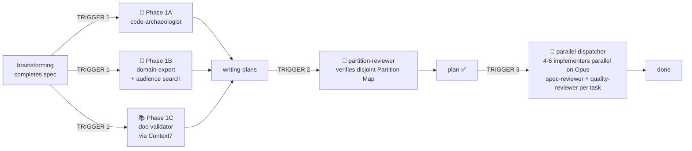

# superpowers-v 💉

**Compound V** — a sidekick to [Superpowers](https://github.com/obra/superpowers).

[](LICENSE)
[](https://docs.claude.com/en/docs/claude-code/plugins)
[](#multi-harness-compatibility)
[](skills/compound-v/phase-3-parallel-opus-dispatch.md)

> *"You don't tell people you're injecting them with Compound V. You just hand them the spec and watch them ship."*

You keep using **Superpowers** the way you already do. Compound V silently shows up at the three phase transitions and does the work that would otherwise burn your day:

- It **measures the building** before you design the addition (code-archaeology)
- It **reads the building code** — including what real users on r/whatever say breaks for them (domain-expert with audience search)
- It **checks every library** against current docs so you don't pin yesterday's `oauth2orize` (Context7 library validator)
- It **partitions the plan** into non-overlapping file sets so implementers can't collide
- It **dispatches them in parallel on Opus** instead of one-at-a-time on a cheap model

You don't invoke Compound V. It invokes itself.

---

## 1 · 2 · 3 — install in three steps

### 1. Install the plugin

**From GitHub (recommended):**
```
/plugin install https://github.com/procoders/superpowers-v
```

**From a local clone (for development):**
```bash
git clone https://github.com/procoders/superpowers-v.git ~/dev/superpowers-v
```
then in Claude Code:
```
/plugin marketplace add ~/dev/superpowers-v
/plugin install superpowers-v
```

### 2. Use Superpowers normally

That's it. Open a session, brainstorm a feature, and watch Compound V appear at the right moments. The SessionStart hook prints a banner so you know it's loaded.

### 3. (Recommended) Add Context7 MCP for Phase 1C

Phase 1C (library/doc validator) uses Context7 MCP for live documentation lookups. It's recommended but not required — without it Phase 1C falls back to WebSearch (slower, less authoritative).

The simplest path is via the official Anthropic plugin marketplace:
```
/plugin install context7@claude-plugins-official
```

Or add it manually to your `~/.claude.json` (or project `.mcp.json`):
```json
{
  "mcpServers": {
    "context7": {
      "command": "npx",
      "args": ["-y", "@upstash/context7-mcp"]
    }
  }
}
```

Verify it's loaded: `/mcp` should show `context7` connected.

---

## What it does (the skyscraper metaphor)

Customer asks for 500m² more space on a 200m² tower.

- **Default Superpowers:** agent staples one 500m² floor on top — an ugly hat, half hanging in air. Ships fast, breaks later.
- **Compound V:** agent runs three audits in parallel (the building is 200m², the building code limits cantilever to 15%, and oauth2orize was abandoned in 2022 so use `@node-oauth/oauth2-server` instead). Proposes three 200m² floors. Customer wanted 500m², gets **600m²** that passes inspection.

See [assets/skyscraper-metaphor.md](assets/skyscraper-metaphor.md) for the comic + technical diagram.

---

## The three phases (auto-fired)



**Trigger 1** (after brainstorming): three pre-flights dispatched in ONE message with three concurrent Task calls.

**Trigger 2** (inside writing-plans): the plan must declare a Partition Map; `partition-reviewer` agent checks it for file-overlap, missed shared resources, and unjustified Sonnet assignments.

**Trigger 3** (at execution): `parallel-dispatcher` runs Task 0 serially, then dispatches parallel batches (4-6 implementers per message) on Opus by default, Sonnet only where justified.

---

## What's in this plugin

```
superpowers-v/
├── .claude-plugin/
│   ├── plugin.json
│   └── marketplace.json                       # local-dev convenience (non-canonical)
├── agents/                                    # 6 first-class subagent definitions
│   ├── code-archaeologist.md                  # → subagent_type: "compound-v:code-archaeologist"
│   ├── domain-expert.md                       # → subagent_type: "compound-v:domain-expert"
│   ├── doc-validator.md                       # → subagent_type: "compound-v:doc-validator"
│   ├── partition-reviewer.md                  # → subagent_type: "compound-v:partition-reviewer"
│   ├── parallel-dispatcher.md                 # → subagent_type: "compound-v:parallel-dispatcher"
│   └── spec-reviewer.md                       # → subagent_type: "compound-v:spec-reviewer"
├── commands/                                  # opt-in slash commands
│   ├── v-archaeology.md                       # /v:archaeology <topic>
│   └── v-dispatch.md                          # /v:dispatch <plan-path>
├── hooks/                                     # hard sidekick auto-fire
│   ├── hooks.json
│   ├── session-banner.sh                      # SessionStart banner
│   ├── sidekick-nudge.sh                      # SubagentStop: nudges on brainstorming/writing-plans completion
│   └── plan-saved-nudge.sh                    # PostToolUse(Write): nudges when a plan/spec is saved
├── skills/
│   └── compound-v/
│       ├── SKILL.md                           # main entry, auto-fires at transitions
│       ├── phase-1a-archaeology.md            # 🔬 technical pre-flight (code reality)
│       ├── phase-1b-domain-expert.md          # 🧠 domain pre-flight (product reality + audience)
│       ├── phase-1c-documentation-validation.md # 📚 library pre-flight (Context7)
│       ├── domain-expert-prompt.md            # advisor dispatch template (fallback)
│       ├── doc-validator-prompt.md            # validator dispatch template (fallback)
│       ├── phase-2-disjoint-partitioning.md   # 🧩 partition-map planning
│       ├── phase-3-parallel-opus-dispatch.md  # 🚀 batched parallel dispatch + model taxonomy
│       └── rationalization-table.md           # rebuttals to every "just this once" excuse
├── assets/
│   └── skyscraper-metaphor.md                 # comic + technical diagram
├── .github/workflows/
│   └── validate.yml                           # CI: JSON schema, agent frontmatter, dead links, shellcheck
├── AGENTS.md                                  # Codex / generic-harness shim
├── GEMINI.md                                  # Gemini CLI shim
├── gemini-extension.json                      # Gemini CLI extension manifest
├── CHANGELOG.md
├── TROUBLESHOOTING.md
├── README.md
└── LICENSE
```

---

## Multi-harness compatibility

| Harness | Status | Entry point |
|---|---|---|
| **Claude Code** | ✅ primary target | `.claude-plugin/plugin.json` |
| **Codex CLI** | ✅ best-effort via shim | [AGENTS.md](AGENTS.md) |
| **Gemini CLI** | ✅ best-effort via shim | [GEMINI.md](GEMINI.md) + [gemini-extension.json](gemini-extension.json) |

The skill content is harness-neutral prose. Tool names differ across harnesses — the shims document the mapping.

---

## Model policy

- **Opus by default** — every implementer, reviewer, advisor
- **Sonnet** — narrow exception per the strict **8-box junior-task taxonomy** in [phase-3](skills/compound-v/phase-3-parallel-opus-dispatch.md). Every Sonnet-assigned task needs a one-line justification in the Partition Map.
- **Never Haiku** — not permitted in this project, even for read-only Explore-style work

The trade: Opus + parallel dispatch is more expensive per-task than default Superpowers. But wall-clock time for N parallel tasks ≈ the slowest task, domain blowups get caught before they're code, and the persistent knowledge bases make every subsequent feature in the same domain progressively cheaper.

---

## Output convention

Compound V writes to a flat, predictable structure under `docs/superpowers/`:

```
docs/superpowers/
├── archaeology/                    # Phase 1A output (per feature)
│   └── YYYY-MM-DD-<topic>.md
├── expert/                         # Phase 1B output + persistent domain KB
│   ├── YYYY-MM-DD-<topic>.md
│   └── _knowledge-base/
│       └── <domain>.md
├── library-audit/                  # Phase 1C output + persistent library KB
│   ├── YYYY-MM-DD-<topic>.md
│   └── _knowledge-base/
│       └── <topic>.md
├── specs/                          # default Superpowers
└── plans/                          # default Superpowers
```

The `_knowledge-base/` subdirectories make each subsequent feature in the same domain or touching the same library cheaper — advisors read these first before running new web searches.

---

## When NOT to use

- Greenfield single-file features (no prior code to audit)
- Pure refactors that touch every file (partitioning impossible)
- Pure plumbing with no user-facing surface (build config, lint rules)
- Exploratory spikes without a spec
- Solo learning / sandbox

Fall back to default Superpowers in those cases — and document why in the plan header.

---

## Slash commands (opt-in)

Most users never need these — the hooks auto-fire the sidekick. But if you want manual control:

| Command | What it does |
|---|---|
| `/v:archaeology <topic>` | Run Phase 1A alone (code-archaeology audit) |
| `/v:dispatch <plan-path>` | Run partition-review + parallel-dispatch on a plan |

---

## Troubleshooting

See [TROUBLESHOOTING.md](TROUBLESHOOTING.md) — covers auto-fire issues, Context7 unavailability, partition violations, rate-limits, and Codex/Gemini gotchas.

---

## Contributing

PRs welcome. CI runs on every push:
- `plugin.json` / `marketplace.json` / `hooks.json` / `gemini-extension.json` schema validation
- Agent frontmatter check (must have `name`, `description`; **must NOT specify Haiku**)
- Skill frontmatter check
- Dead intra-plugin `.md` link check
- Hook script executability + `shellcheck`

See [.github/workflows/validate.yml](.github/workflows/validate.yml).

---

## License

MIT. See [LICENSE](LICENSE).
