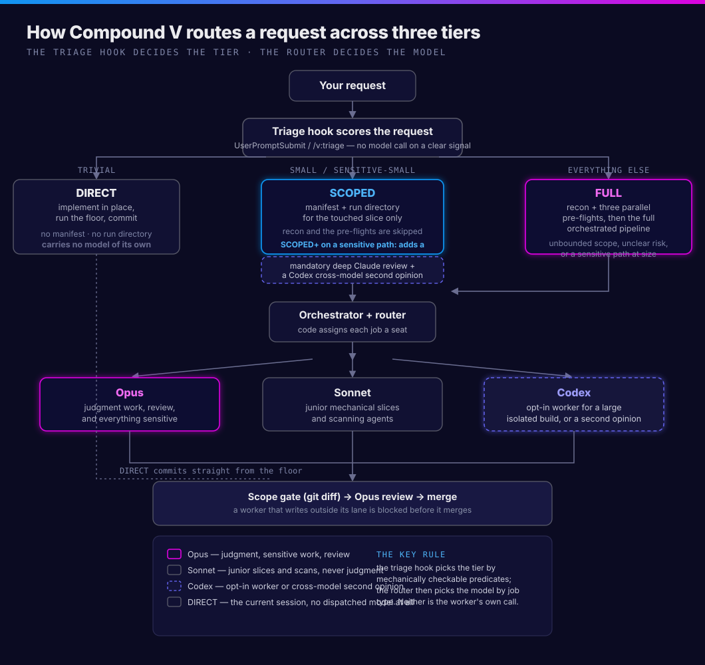

# superpowers-v 💉

**Compound V** — a multi-model coding sidekick for [Superpowers](https://github.com/obra/superpowers), running on Claude Code.


You describe a feature. Claude sizes the request, plans it, splits it into non-overlapping pieces, and hands each piece to a worker in its own isolated worktree.
Every write is checked against the files that worker was allowed to touch, and a review gates "done". There is no start button — a hook sizes each request as you work.

## Requirements
- **Claude Code ≥ 2.1.219.** Compound V runs on the native Workflow runtime and on native hook events (`PreToolUse`, `UserPromptSubmit`, `PostCompact`, `Stop`). Older versions lack them.
- **One ambient cost.** The lane-guard hook runs on every `Write`/`Edit`/`Bash` call and takes roughly 150–240 ms, depending on the machine. The numbers and the method are in [AGENTS.md](AGENTS.md).
- **One project setting.** `worktree.baseRef` has to be `head` for jobs that depend on each other. It is a native Claude Code setting, not a Compound V one — see Install.

## Install
```
/plugin marketplace add https://github.com/procoders/superpowers-v
/plugin install superpowers-v@procoders
```

**Other model CLIs are optional.** Install and log into them and Compound V picks them up; without them it runs Claude-only.

- **Codex** (≥ 0.144.6, for the gpt-5.6 family): `npm i -g @openai/codex` → `codex login`
- **Cursor:** `curl https://cursor.com/install -fsS | bash` → `cursor-agent login`
- **Antigravity:** install the `agy` CLI → log in

Then the one setting. `worktree.baseRef` is a **native Claude Code project setting** in the project's `.claude/settings.json`, with two values: `fresh` (the default) and `head`. It is
project-wide: `head` branches every worktree from the current `HEAD`, your own `--worktree` sessions included. A job that depends on another needs it, or its worktree cannot see that job.

```json
{ "worktree": { "baseRef": "head" } }
```

_(Optional)_ Context7 MCP sharpens the library-docs check: `/plugin install context7@claude-plugins-official`.

## How to use it
Run this once — it detects which model CLIs you have, saves the config, and offers the `baseRef` setting above.

```
/v:init
```

**Then just work.** Describe the feature, or start brainstorming as usual. A `UserPromptSubmit` hook scores the first change request of each session
and sizes it as DIRECT, SCOPED or FULL. There is no command to launch the orchestration; Claude runs it for you.

## 🎮 New here? Learn it as a game → **[Compound V Academy](https://amiainative.dev/compound-v)**
Three gamified episodes walk you through the whole pipeline, and the **[cheatsheet](https://amiainative.dev/compound-v/cheatsheet)** puts commands, triggers, memory and routing on one page.

## How it routes the work


- **DIRECT** — a trivial, unambiguous edit: one worker edits, runs the test floor, commits. No model routing happens: it is an ordinary commit by whichever model is already in the session.
- **SCOPED** — a bounded change: only the tests that reference what changed run, not the whole suite. The Opus reviewer still gates done.
- **SCOPED+** — a small edit on a sensitive path: SCOPED plus a mandatory deep review and a cross-model (Codex) second opinion, with you accepting.
- **FULL** — anything real: recon, three pre-flights (archaeology, domain, library), plan, manifest, parallel dispatch in worktrees, a three-pass Opus review, then an optional Codex diff review.

**Who does what.** Opus plans, judges and reviews; Fable (the frontier tier) is opt-in for business-critical jobs, and lifts a review job once —
only after that job has exhausted its retry budget on Opus (repeated 529s, say), never merely because Opus looks busy. Sonnet runs junior slices
and the two scanning agents. Codex is an opt-in sandboxed worker and the second opinion; Antigravity and Cursor are lower-trust opt-in workers. The scope gate blocks out-of-lane writes.

## Main features
- **Multi-model orchestration.** Codex is dogfooded in this repository. Antigravity and Cursor have their CLI invocation verified live but have never been dispatched here.
  opencode and Devin are experimental: the adapters exist, execution is unverified.
- **Cross-model review.** A second opinion from another model family, on the plan and on the code. Different models have different blind spots. Advisory — the orchestrator decides.
- **Epic mode.** Feed it a whole PRD and it builds feature by feature, in dependency order, on one branch. It checkpoints after each feature unless you raise the budget.
- **Epic autonomy.** On the `marathon` stance, `/v:epic` offers — never arms silently — a native way to keep going: `/loop` to keep resuming in this session, or `/schedule` in the cloud.
- **V-memory.** Project memory over `docs/superpowers/**`: decisions, bugs, dead ends. Local and offline; a search refreshes its own index first, and reviewers read it before every verdict.
- **Co-change advisory.** When the partition reviewer runs, it asks git history which files almost always move together, and warns when a plan forgot one. It never changes a verdict.
- **Research-grounded brainstorming** 🧪 — on an unfamiliar topic, a gated recon pass writes an evidence doc the brainstorm reads first, and independent questions batch into one screen.

## Commands
| Command | What it does |
|---|---|
| `/v:init` | Set up the project: detect backends, pick a routing stance, save the config |
| `/v:onboard` | Build a citation-verified knowledge base of this repo, behind an approval gate |
| `/v:epic <PRD>` | Build a multi-feature PRD feature by feature, in dependency order, on one branch |
| `/v:dispatch <plan\|manifest\|run-id>` | Run the pipeline: partition review → parallel dispatch → scope gate → review |
| `/v:orchestrate <plan>` | Materialize the manifest from a plan, without dispatching it |
| `/v:triage` | Size one change request and write the triage record: DIRECT, SCOPED or FULL |
| `/v:review-plan <plan>` | Cross-model (Codex) adversarial review of a plan before dispatch |
| `/v:pr-review [url\|number]` | Two-axis review of a PR, an MR, or a local branch. Never edits code |
| `/v:adr <decision>` | Record one architecture decision as a thin, human-confirmed ADR |
| `/v:remember "<query>"` | Search the project memory for what this repo already learned |
| `/v:memory-refresh` | Re-index the memory; `--bootstrap` adds the optional semantic lane |
| `/v:status [run-id]` | Show a run's phase and per-job table; `--live` watches a running dispatch |
| `/v:collect <run-id>` | Re-run the collect + scope-gate + review tail of a run, without re-dispatching workers |
| `/v:resume <run-id>` | Reconcile against git and re-dispatch only the jobs that did not finish |
| `/v:dashboard` | Emit a static HTML snapshot of past runs and epics |
| `/v:preferences` | Your own past reasoning, as falsifiable memory plus a challenge |
| `/v:models` | Refresh which concrete model each backend tier uses |

## What runs in every session
| Event | What it does |
|---|---|
| `SessionStart` | Prints the resume banner; refreshes the memory index in the background |
| `UserPromptSubmit` | Scores the first change request of the session and writes the triage record |
| `PreToolUse` (Write/Edit/Bash) | The lane guard: refuses a write outside the job's declared lane |
| `PreToolUse` (Skill) | Reminds a brainstorm to run its recon pass first. Reminder only |
| `PostToolUse` (Write) | Nudges when a plan is saved; refreshes the memory index |
| `PreCompact` / `PostCompact` | Snapshots the run state before a compaction, and reports it after |
| `Stop` | The triage gate: holds the turn open when code changed and no triage record covers it |

The triage gate is on by default. It is exempt on `docs/superpowers/**`, fires at most once per session, and fails open. To turn it off, put
`{ "enforcement": { "triage_gate": false } }` in `.claude/compound-v.json` — an explicit `false` is the only value that does it.

## Good to know
- **Antigravity and Cursor are lower-trust** — no kernel sandbox, so the scope gate catches an out-of-bounds write after the fact but cannot prevent it. Prefer Codex for anything sensitive.
- **Cursor on a Free plan** can only use its `auto` model; named models are paid.
- **Epic mode is bounded by default** — it stops after each feature for a human checkpoint, and is not an overnight build unless you raise the budget.
- **Marathon mode is still not fire-and-forget.** It drops the checkpoint and adds an arbiter panel, a blocker ledger and breakers, but after a hard death you re-run `/v:epic <epic-id>` yourself.

## Verification program
Compound V is dogfooded against its own claims in eight staged cycles, each run against native Claude Code mechanisms rather than trusted from prose. Every cycle's review is
recorded in [docs/superpowers/dogfood/README.md](docs/superpowers/dogfood/README.md) — a generated index whose footer carries the current tally and is the
source of truth for it (56 reviews, 11 APPROVED as this was written). Read it for the current stage.

1. **DIRECT, attended** — one file, an ordinary commit, the Stop gate silent.
2. **SCOPED** — the triage-size feature, run through the SCOPED path itself.
3. **FULL with zero manual interventions** — the transcript-watch feature.
4. **Multi-model** — a `backend: codex` job dispatched on Engine C.
5. **The first epic** — features chained end to end on one branch; 5a and 5b cover V-memory recall being real, then recall turning into action.
6. **A foreign repository** — set up from `/v:init` and driven through a real change.
7. **Death and resurrection** — a killed run resumed from committed state.
8. **A perfect pass with a stopwatch.**

## Under the hood
The orchestration, scope enforcement, routing and memory are plain bash and Python scripts and skill docs you can read.

- [skills/compound-v/SKILL.md](skills/compound-v/SKILL.md) — the orchestrator · [skills/compound-v/epic-mode.md](skills/compound-v/epic-mode.md) — epic mode
- [skills/compound-v/memory.md](skills/compound-v/memory.md) — V-memory · [skills/backend-launcher/SKILL.md](skills/backend-launcher/SKILL.md) — the backend workers
- [CHANGELOG.md](CHANGELOG.md) — version history · [TROUBLESHOOTING.md](TROUBLESHOOTING.md) — when it breaks

Built as a sidekick to [Superpowers](https://github.com/obra/superpowers). MIT licensed.
