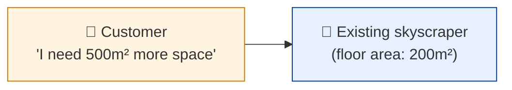
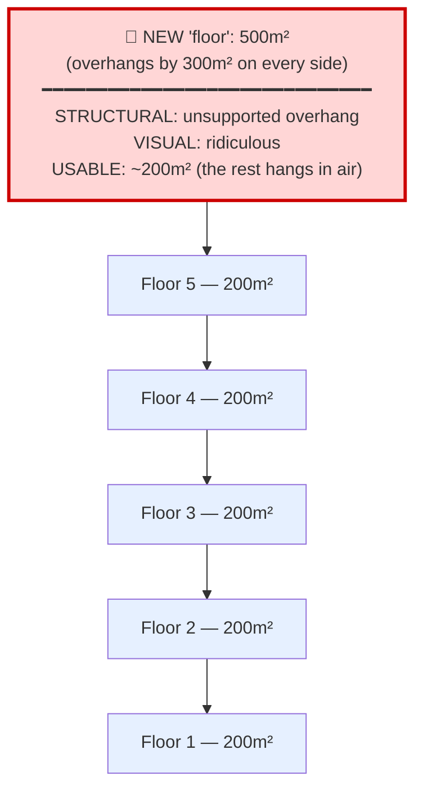
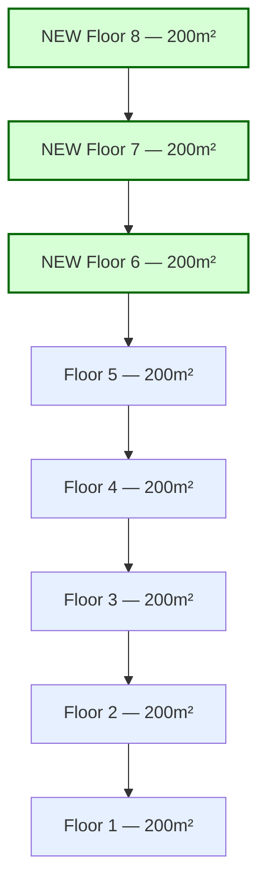
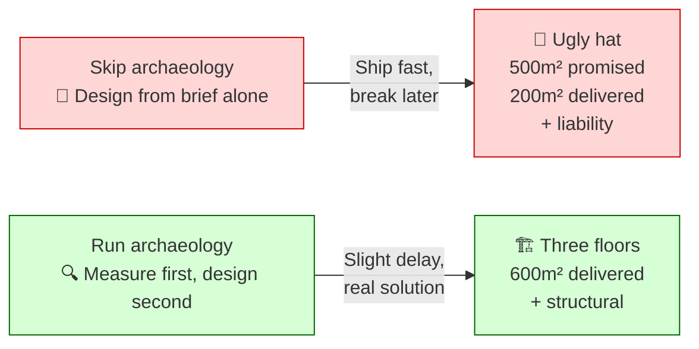

# Why Two Pre-Flights — The Skyscraper Metaphor

A 3-panel comic and a technical diagram explaining what Compound V's Phase 1 (parallel archaeology + domain-expert) actually protects against.

**Two layers of "missed reality":**
- **Archaeology** = what the existing **building** is (measure before you stack)
- **Domain advisor** = what the **building code** requires (legal cantilever, zoning, fire-egress)

Skip either and you ship something that's either physically wrong or legally wrong. Often both.

---

## The Story (Comic, 3 Panels)

### Panel 1 — The Customer's Request

**Customer says:** "Add 500m² to my building."
**The building says nothing.** Nobody's checked what it actually is.

---

### Panel 2A — Without Archaeology: The Ugly Hat

**Agent took the brief literally.** Built one 500m² floor on top of a 200m² tower. The overhang is unsupported. Most of the new "space" hangs in mid-air. The customer asked for 500m²; they got 200m² of usable space and a structural liability.

**In code terms:** the agent shipped a feature that *looks* like the spec but sits on assumptions the existing code can't support. Hidden coupling fires in production.

---

### Panel 2B — With Archaeology: Three Proper Floors

**Agent measured first.** Discovered the floor area is 200m². Proposed three proper 200m² floors instead of one mutant. Customer wanted 500m² and got **600m²** of usable, supported, beautiful space.

**In code terms:** the agent ran code-archaeology, saw the actual matrix (server types, shared state, sibling paths), and proposed a design that fits — extending what exists instead of stapling a foreign block on top.

---

### Panel 3 — The Lesson

**The 10 minutes you spend on archaeology buys you the difference between an ugly hat and three real floors.**

---

## The Technical View

Same story, mapped onto Compound V's three phases (with parallel pre-flight 1A + 1B + 1C):

> *Period piece: this diagram predates per-job isolation ("no worktrees" was the v0.1 stance — external workers now get git worktrees + the scope gate) and the v2.7 pre-brainstorm recon (Trigger 0); it keeps the original shape because the metaphor hasn't changed.*

```mermaid
flowchart TB
    subgraph Default["❌ Default Superpowers (no archaeology)"]
        direction LR
        B1["brainstorming<br/>(imagines the building)"] --> P1["writing-plans<br/>(designs the hat)"]
        P1 --> X1["sequential implementer<br/>on cheap model"]
        X1 --> Y1["🎩 Ugly hat shipped<br/>Coupling bugs surface in prod"]
    end

    subgraph Compound["✅ Compound V (parallel pre-flight + partitioning + parallel Opus)"]
        direction LR
        B2["brainstorming"] --> A2A["🔬 PHASE 1A<br/>code-archaeology<br/>(measures the building)"]
        B2 --> A2B["🧠 PHASE 1B<br/>domain-expert advisor<br/>(reads the building code)"]
        A2A --> P2["writing-plans<br/>+ 🧩 PHASE 2<br/>Disjoint Partition Map"]
        A2B --> P2
        P2 --> X2["🚀 PHASE 3<br/>N implementers on Opus,<br/>in parallel,<br/>no worktrees,<br/>scope-locked"]
        X2 --> Y2["🏗️ Three floors shipped<br/>Fits existing structure<br/>Passes inspection<br/>Parallel = wall-clock fast"]
    end

    style Default fill:#fff0f0,stroke:#cc0000
    style Compound fill:#f0fff0,stroke:#006600
    style Y1 fill:#ffd6d6
    style Y2 fill:#d6ffd6
    style A2A fill:#fffae6,stroke:#cc7700,stroke-width:2px
    style A2B fill:#e6f3ff,stroke:#0066cc,stroke-width:2px
    style P2 fill:#fffae6,stroke:#cc7700,stroke-width:2px
    style X2 fill:#fffae6,stroke:#cc7700,stroke-width:2px
```

### The trade

| Dimension | Default Superpowers | Compound V |
|---|---|---|
| Time to plan | Fast (skip audit) | +10 min for audit |
| Time to execute | Slow (sequential, N tasks = N×) | Fast (parallel, N tasks ≈ 1×) |
| Model cost per task | Cheap | Opus (~5× per task) |
| Cost of rework when coupling breaks | High (debug in prod) | Low (caught at design) |
| **Result for the customer** | 🎩 **Hat** | 🏗️ **Three floors** |

---

## TL;DR

> **Measure the building. Read the building code. Partition before you parallelize. Then go fast on the strong model.**
