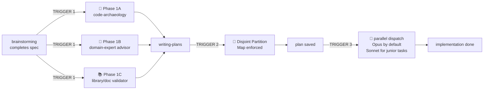

# Compound V

> *"You don't tell people you're injecting them with Compound V. You just hand them the spec and watch them go faster."* — internal Vought memo, probably

Compound V is a **transparent interceptor** that sits between Superpowers phases AND, as of v1.0, a **lightweight execution orchestrator** — the orchestrated pipeline is now the default execution path. You don't invoke it directly — it fires automatically at three transitions:

1. **After `brainstorming`, before `writing-plans`** → injects THREE parallel pre-flights:
   - **Phase 1A: Code-Archaeology** — the *technical* reality of the existing code
   - **Phase 1B: Domain-Expert Advisor** — the *product/domain* reality (web-searched if needed, knowledge-base persisted)
   - **Phase 1C: Library/Doc Validator** — *library currency* via Context7 MCP (stale deps, abandoned libs, outdated API signatures)
2. **Inside `writing-plans`** → enforces **Disjoint File Partitioning** and **materializes a `manifest.yaml`** (the machine-readable contract) so tasks can run in parallel
3. **At execution** → runs the **orchestration pipeline**: dispatch each manifested job to its backend (Claude subagent on **Opus by default**, Sonnet only for clearly junior mechanical tasks, or a headless **Codex** worker for large isolated builds — see `phase-3-parallel-opus-dispatch.md`), **enforce file-scope with a `git diff` gate after every job**, collect canonical `job_result`s, review against the spec's Acceptance Criteria, and update outcome memory. Runs **autonomously with guardrails** and is **crash-resumable** via `state.json`.

**The unified pipeline (orchestrator-as-default):**

```
brainstorm ─► spec (carries feature-level Acceptance Criteria)
   ▼ auto-fire
[1A archaeology ∥ 1B domain ∥ 1C library] ─► 3 audits   (🔴 critical finding → HALT)
   ▼ writing-plans + Phase 2 Partition Map
★ MANIFEST  docs/superpowers/execution/<run-id>/manifest.yaml   (partition FAIL → HALT)
   ▼ DISPATCH — batched Task (4–6) ∥ Codex via backend-launcher; per-job worktree|direct
★ COLLECT + SCOPE GATE  git diff --name-only vs write_allowed   (violation → BLOCKED → HALT)
   ▼ REVIEW  spec + quality + final integration (Opus), AC-gated   (unfixable ISSUES → HALT)
   ▼ MEMORY  append task-outcomes.jsonl + routing-lessons.md
   ▼ finishing-a-development-branch
                          state.json updated after every phase ──► /v:status · /v:resume
```

The orchestration contracts and scripts live alongside this skill: the manifest schema in [execution-manifest.md](execution-manifest.md), the backend contract in [backend-launcher/SKILL.md](../backend-launcher/SKILL.md), and the canonical result shape in [schemas/job_result.schema.json](../../schemas/job_result.schema.json). **No daemon, no MCP server, no vector DB, no fabricated cost metrics** — the anti-ruflo charter. Manual control is available via `/v:orchestrate`, `/v:dispatch`, `/v:collect`, `/v:status`, `/v:resume`, `/v:init`; in default operation the agent flows through orchestrate → dispatch → collect itself.

**Why three pre-flights, in parallel:**
- 1A catches "the building is 200m², not 500m²" (existing code reality)
- 1B catches "you're designing OAuth but Notion uses Basic auth + JSON body" (domain reality)
- 1C catches "the spec suggests oauth2orize but it hasn't been updated in 4 years; use @node-oauth/oauth2-server" (library currency)

All three are independent — different failure modes, different lookup paths, no shared state. Dispatch them in **one message with three concurrent Task calls** to keep wall-clock cost low.

**Auto-fire caveat:** "Auto-fires after brainstorming" is **description-driven** (the parent agent reads this skill's description and recognizes the trigger condition). It is NOT enforced by Claude Code hooks. The plugin ships two helper hooks (`SessionStart` banner + `PostToolUse` plan-saved nudge) that print *reminders* to the parent agent, but the actual skill invocation still depends on the parent recognizing the description trigger. Reliability is high on Opus / Sonnet 4.6+; weaker models may miss the trigger.

**The skyscraper metaphor** (see [assets/skyscraper-metaphor.md](../../assets/skyscraper-metaphor.md)): Without pre-flight you build a 500m² hat on a 200m² tower. With both audits, you add three proper floors that fit the building AND the building code.

**Announce at start of each phase:**
- Phase 1: `"💉 Compound V injected — triple pre-flight (archaeology + domain-expert + library-validator) in parallel."`
- Phase 2: `"💉 Compound V — enforcing Disjoint Partition Map."`
- Phase 3: `"💉 Compound V — dispatching N implementers in parallel on Opus."`

(Heavy theming is optional flavor; technical content is straight business.)

---

## When This Skill Fires



**Trigger 1 — Parallel Pre-Flight (1A + 1B + 1C).** Fires when brainstorming produces a spec. All three pre-flights run **in a single message with three concurrent Task calls** — they don't depend on each other.
- 1A: archaeology — see [phase-1a-archaeology.md](phase-1a-archaeology.md). Saves to `docs/superpowers/archaeology/`.
- 1B: domain advisor — see [phase-1b-domain-expert.md](phase-1b-domain-expert.md). Saves to `docs/superpowers/expert/`.
- 1C: library/doc validator — see [phase-1c-documentation-validation.md](phase-1c-documentation-validation.md). Saves to `docs/superpowers/library-audit/`.

**Trigger 2 — Partition Enforcement.** Fires when writing-plans is about to define tasks. Plan must declare a Partition Map with mutually exclusive file sets. See [phase-2-disjoint-partitioning.md](phase-2-disjoint-partitioning.md).

**Trigger 3 — Parallel Opus Dispatch.** Fires when execution begins. Overrides default Superpowers' "no parallel implementers" and "cheap model" defaults. See [phase-3-parallel-opus-dispatch.md](phase-3-parallel-opus-dispatch.md).

---

## What Compound V Overrides

| Default Superpowers behavior | Compound V override |
|---|---|
| Brainstorming → writing-plans (direct) | Brainstorming → **archaeology ∥ domain-expert ∥ library-validator** → writing-plans |
| Plan tasks may touch overlapping files | Plan **must** partition files disjointly; reviewer rejects overlap |
| Implementer subagents run **sequentially** ("never in parallel — conflicts") | Implementers run **in parallel** (conflicts impossible by partition); practical batch size 4-6 concurrent — see phase-3 |
| Implementer uses cheap/standard model by default | Implementer dispatched with **`model: "opus"`** by default; **`model: "sonnet"`** allowed only for clearly junior-level mechanical tasks (strict taxonomy in phase-3) |
| Isolated work uses **git worktrees** globally | **Per-job isolation** — `direct` writes for disjoint Claude jobs; a `worktree` for Codex/external workers and overlap-prone jobs. The `git diff` scope gate runs on every job regardless. |
| Spec + quality reviewers run sequentially per task | Reviewers run **per-task in parallel** after each batch completes |
| No persistent domain knowledge between sessions | Phases 1B and 1C save **knowledge bases** at `docs/superpowers/{expert,library-audit}/_knowledge-base/` reused on future related features |
| Library suggestions from LLM training data | Phase 1C validates against **live Context7 MCP** before any library is locked into the plan |

**Violating the letter of these overrides is violating the spirit.** See [rationalization-table.md](rationalization-table.md) for the rebuttal sheet.

---

## The Three Phases — Quick Reference

### Phase 1: Parallel Pre-Flight (1A + 1B + 1C)

After brainstorming produces a spec, BEFORE invoking writing-plans, dispatch ALL THREE pre-flights in **one message with three concurrent Task calls**:

**1A — Archaeology** (the existing code's reality):
- Check archaeology triggers (middleware, shared state, sibling paths, external APIs)
- Five-phase audit: matrix, shared-state, sibling read, external API via context7, regression + DRY
- File Touch Map appended for Phase 2 partitioning
- Output: `docs/superpowers/archaeology/YYYY-MM-DD-<topic>.md`

**1B — Domain-Expert Advisor** (the product/domain's reality):
- Universal advisor figures out the domain from the spec
- Checks `docs/superpowers/expert/_knowledge-base/` for prior knowledge; reads + reuses if relevant
- Runs **parallel WebSearch** calls if domain expertise is thin (3–6 queries in one message)
- Identifies must-know domain constraints, conventions, common traps, regulatory/UX/algorithmic pitfalls
- Output: `docs/superpowers/expert/YYYY-MM-DD-<topic>.md` + updates to persistent KB

**1C — Library/Doc Validator** (the dependencies' currency):
- Extracts every library/SDK/framework the spec mentions or implies
- Validates each via **Context7 MCP** (preferred) or WebSearch fallback
- Flags 🔴 abandoned (>24mo no commits, archived), 🟠 stale (12-24mo), 🟡 major-version-behind, 🟢 OK
- Verifies API signatures against current docs (the LLM's training data is stale)
- Output: `docs/superpowers/library-audit/YYYY-MM-DD-<topic>.md` + updates to persistent KB

**All three** outputs feed into `writing-plans`. Their "Design constraints" sections compose into the plan's non-negotiable requirements.

**Skip rules:**
- 1A: greenfield in a new directory, pure UI, copy/config edits
- 1B: skip only if the spec is entirely about *plumbing* (build system, lint config, internal refactor with no user-facing behavior). If users will see or feel it, domain expertise applies.
- 1C: skip only if the spec mentions zero libraries/SDKs/frameworks/runtimes (rare). When in doubt, run it — Context7 lookups are cheap.

### Phase 2: Disjoint File Partitioning

Inside writing-plans:
1. Map every file the implementation will touch (from 1A's File Touch Map).
2. Assign each file to exactly one task. No file appears in two tasks.
3. Declare the Partition Map at the top of the plan.
4. Shared resources (lockfiles, generated code, schema migrations, barrels, type files) → serial pre-phase (Task 0).

If natural decomposition produces overlap, redesign the decomposition (split by feature slice, not by layer). See phase-2 doc.

### Phase 3: Parallel Opus Dispatch

When the plan is ready:
1. Run Task 0 sequentially (if present).
2. Dispatch all N parallel implementers in **one message with N concurrent Task calls**:
   - `model: "opus"`
   - Strict WRITE-allowed / READ-allowed scope lock
   - Full task text + design constraints from BOTH audits (archaeology + expert)
3. When all implementers return, dispatch 2N reviewers in parallel (spec + quality per task), also on Opus.
4. Per-task fix loops, then final integration review.

**Per-job isolation.** Disjoint Claude jobs write directly to the active workspace (partitioning prevents collisions); Codex/external workers and overlap-prone jobs run in a worktree under `$TMPDIR/compound-v/<run-id>/<job-id>`, merged back on PASS via an index-based patch that includes new files (`git -C <wt> add -A && git -C <wt> diff --cached --binary HEAD | (cd <repo> && git apply --index)`; a plain `git diff HEAD | git apply` would drop allowed untracked additions). The `git diff` scope gate runs on every job either way; a BLOCKED job never merges. See `phase-3-parallel-opus-dispatch.md` and [backend-launcher/SKILL.md](../backend-launcher/SKILL.md).

---

## Hard Rules (the Iron Five)

1. **No plan without a Phase 1A archaeology audit** if any audit-trigger applies.
2. **No plan without a Phase 1B domain-expert audit** if the spec has any user-facing or domain-specific surface.
3. **No plan without a Phase 1C library/doc audit** if the spec mentions or implies any library/SDK/framework.
4. **No execution without a verified Partition Map** in the plan.
5. **No sequential implementer dispatch** when the Partition Map shows N≥2 parallel-safe tasks.

Violating any of these = stop, fix, restart the phase.

---

## Output Directory Conventions

Compound V writes to a flat, predictable structure under `docs/superpowers/`:

```plaintext
docs/superpowers/
├── archaeology/
│   └── YYYY-MM-DD-<topic>.md          # Phase 1A output per feature
├── expert/
│   ├── YYYY-MM-DD-<topic>.md          # Phase 1B output per feature
│   └── _knowledge-base/
│       └── <domain>.md                 # Persistent domain KB
├── library-audit/
│   ├── YYYY-MM-DD-<topic>.md          # Phase 1C output per feature
│   └── _knowledge-base/
│       └── <topic>.md                  # Persistent library KB (version notes, alternatives)
├── execution/                          # v1.0 orchestrator — one run dir per run
│   └── <run-id>/
│       ├── manifest.yaml               # the planner↔executor contract (execution-manifest.md)
│       ├── state.json                  # phase + per-job status {pending|running|done|blocked|failed}
│       ├── jobs/<id>.prompt.md         # dispatched prompt (for re-dispatch on resume)
│       └── results/<id>.json           # normalized job_result (job_result.schema.json)
├── memory/                             # v1.0 lean outcome memory (closes the routing loop)
│   ├── task-outcomes.jsonl             # one line per job, appended by the collector
│   └── routing-lessons.md              # human-curated routing lessons
├── specs/                              # default Superpowers
└── plans/                              # default Superpowers
```

The `_knowledge-base/` subdirectories hold **persistent knowledge** the advisors accumulate across features. On future related work, advisors read these first before running new web searches / Context7 queries — making each subsequent feature in the same domain or touching the same library cheaper and faster.

The `execution/<run-id>/` directory **is** the run record and audit trail — `state.json` + `results/` are both execution substrate and the only observability surface (no separate `run.log` / `cost-estimate.md`; we do not print token-cost numbers we cannot measure). The `memory/` directory accumulates routing outcomes across runs: `task-outcomes.jsonl` is appended automatically by the collector, `routing-lessons.md` is human-curated.

---

## Red Flags — STOP

If you catch yourself thinking any of these, you're about to break Compound V:

- "Code-archaeology is overkill" → run it; the skip rule is the only exception
- "Domain expertise is obvious to me" → write it down anyway; the file is the deliverable
- "Context7 is too slow to query" → run it; lookups are seconds, library lock-ins are weeks of rework
- "I'll just dispatch one implementer first and see how it goes" → that's sequential. Dispatch all N or you've reverted.
- "The plan is fine, I'll skip the Partition Map" → without the map, parallel dispatch is unsafe
- "This task looks simple, let me grab Sonnet for it" → check the strict junior-task taxonomy in phase-3 first. If you can't tick every box, it's Opus.
- "Worktrees are safer, let me put every job in one" → isolation is per-job: `direct` for disjoint Claude jobs, `worktree` only for Codex/external or overlap-prone work. The `git diff` scope gate is what actually keeps you safe — it runs either way.
- "I'll run 1A and 1B and 1C sequentially, not parallel" → they're independent; sequential triples wall-clock for no benefit

See [rationalization-table.md](rationalization-table.md) for the full list with rebuttals.

---

## Integration With Superpowers

| Superpowers skill | Compound V action |
|---|---|
| `superpowers:brainstorming` | Run unchanged. On completion, fire Trigger 1 (1A + 1B + 1C in parallel). |
| `code-archaeology` (mcpize or equivalent) | Inserted as Phase 1A. |
| Universal domain-expert advisor (this plugin) | Inserted as Phase 1B. Dispatchable as `subagent_type: "compound-v:domain-expert"` (see `agents/domain-expert.md`). |
| Library/doc validator via Context7 (this plugin) | Inserted as Phase 1C. Dispatchable as `subagent_type: "compound-v:doc-validator"` (see `agents/doc-validator.md`). |
| MCP `plugin:context7:context7` | Required for Phase 1C (Phase 1C degrades to WebSearch if Context7 unavailable). |
| `superpowers:writing-plans` | Run with Partition Map requirement (Trigger 2). |
| `superpowers:subagent-driven-development` | Replace its "sequential implementer, cheap model, with worktree" defaults with Compound V dispatch (Trigger 3). |
| `superpowers:dispatching-parallel-agents` | Compound V uses this skill's parallel pattern for implementers, not just for investigation. |
| `superpowers:using-git-worktrees` | **Per-job, planner-decided.** Direct writes for disjoint Claude jobs (fast); a worktree for Codex/external workers (mandatory) and any overlap-prone Claude job. The `git diff` scope gate is the constant either way; the worktree is the escalation. |
| `superpowers:executing-plans` | If chosen instead of subagent-driven, still apply parallel + Opus rules where possible. |

---

## One-Sentence Summary

**Inject Compound V: audit the code, audit the domain, audit the libraries — all in parallel. Partition the files. Then dispatch Opus implementers in parallel (Sonnet only for clearly junior tasks). No worktrees, no sequential drag, no shared-file surprises, no domain blind spots, no stale dependencies.**
