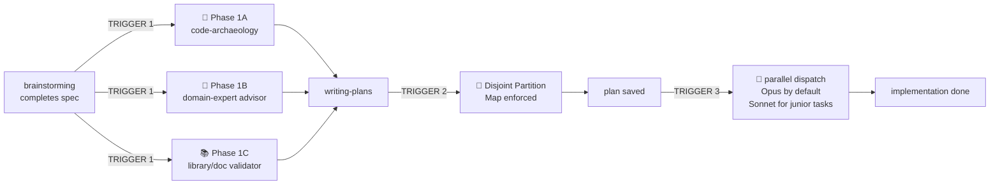

# Compound V

> *"You don't tell people you're injecting them with Compound V. You just hand them the spec and watch them go faster."* — internal Vought memo, probably

Compound V is a **transparent interceptor** that sits between Superpowers phases. You don't invoke it directly — it fires automatically at three transitions:

1. **After `brainstorming`, before `writing-plans`** → injects THREE parallel pre-flights:
   - **Phase 1A: Code-Archaeology** — the *technical* reality of the existing code
   - **Phase 1B: Domain-Expert Advisor** — the *product/domain* reality (web-searched if needed, knowledge-base persisted)
   - **Phase 1C: Library/Doc Validator** — *library currency* via Context7 MCP (stale deps, abandoned libs, outdated API signatures)
2. **Inside `writing-plans`** → enforces **Disjoint File Partitioning** so tasks can run in parallel
3. **At execution** → dispatches implementer subagents **in parallel on Opus by default** (Sonnet allowed only for clearly junior-level mechanical tasks — see the strict taxonomy in `phase-3-parallel-opus-dispatch.md`), bypasses git worktrees, direct workspace writes

**Why three pre-flights, in parallel:**
- 1A catches "the building is 200m², not 500m²" (existing code reality)
- 1B catches "you're designing OAuth but Notion uses Basic auth + JSON body" (domain reality)
- 1C catches "the spec suggests oauth2orize but it hasn't been updated in 4 years; use @node-oauth/oauth2-server" (library currency)

All three are independent — different failure modes, different lookup paths, no shared state. Dispatch them in **one message with three concurrent Task calls** to keep wall-clock cost low.

**Auto-fire caveat:** "Auto-fires after brainstorming" is description-driven (the parent agent recognizes the trigger from this skill's description and invokes it). It is NOT enforced by Claude Code hooks — hooks fire on lifecycle events (SessionStart, SubagentStop, PreToolUse), not on description matches. If you want hard enforcement, wrap brainstorming's exit in a `SubagentStop` hook that runs `Skill compound-v`. Otherwise, trust the description-based trigger.

**The skyscraper metaphor** (see [assets/skyscraper-metaphor.md](../../assets/skyscraper-metaphor.md)): Without pre-flight you build a 500m² hat on a 200m² tower. With both audits, you add three proper floors that fit the building AND the building code.

**Announce at start of each phase:**
- Phase 1: `"💉 Compound V injected — triple pre-flight (archaeology + domain-expert + library-validator) in parallel."`
- Phase 2: `"💉 Compound V — enforcing Disjoint Partition Map."`
- Phase 3: `"💉 Compound V — going Supe: N implementers parallel on Opus."`

(Heavy theming is optional flavor; technical content is straight business.)

---

## When This Skill Fires



**Trigger 1 — Parallel Pre-Flight (1A + 1B + 1C).** Fires when brainstorming produces a spec. All three pre-flights run **in a single message with three concurrent Task calls** — they don't depend on each other.
- 1A: archaeology — see [phase-1a-archaeology.md](phase-1a-archaeology.md). Saves to `docs/superpowers/archaeology/`.
- 1B: domain advisor — see [phase-1b-domain-expert.md](phase-1b-domain-expert.md). Saves to `docs/superpowers/expert/`.
- 1C: library/doc validator — see [phase-1c-documentation-validation.md](phase-1c-documentation-validation.md). Saves to `docs/superpowers/library-audit/`.

**Trigger 2 — Partition Enforcement.** Fires when writing-plans is about to define tasks. Plan must declare a Partition Map with mutually exclusive file sets. See [phase-2-disjoint-partitioning.md](phase-2-disjoint-partitioning.md).

**Trigger 3 — Parallel Opus Dispatch.** Fires when execution begins. Overrides default Superpowers' "no parallel implementers" and "cheap model" defaults. See [phase-3-parallel-opus-dispatch.md](phase-3-parallel-opus-dispatch.md).

---

## What Compound V Overrides

| Default Superpowers behavior | Compound V override |
|---|---|
| Brainstorming → writing-plans (direct) | Brainstorming → **archaeology ∥ domain-expert ∥ library-validator** → writing-plans |
| Plan tasks may touch overlapping files | Plan **must** partition files disjointly; reviewer rejects overlap |
| Implementer subagents run **sequentially** ("never in parallel — conflicts") | Implementers run **in parallel** (conflicts impossible by partition); practical batch size 4-6 concurrent — see phase-3 |
| Implementer uses cheap/standard model by default | Implementer dispatched with **`model: "opus"`** by default; **`model: "sonnet"`** allowed only for clearly junior-level mechanical tasks (strict taxonomy in phase-3) |
| Isolated work uses **git worktrees** | **No worktrees** — direct writes to active workspace (saves 1-2 sec per spawn × N spawns) |
| Spec + quality reviewers run sequentially per task | Reviewers run **per-task in parallel** after each batch completes |
| No persistent domain knowledge between sessions | Phases 1B and 1C save **knowledge bases** at `docs/superpowers/{expert,library-audit}/_knowledge-base/` reused on future related features |
| Library suggestions from LLM training data | Phase 1C validates against **live Context7 MCP** before any library is locked into the plan |

**Violating the letter of these overrides is violating the spirit.** See [rationalization-table.md](rationalization-table.md) for the rebuttal sheet.

---

## The Three Phases — Quick Reference

### Phase 1: Parallel Pre-Flight (1A + 1B + 1C)

After brainstorming produces a spec, BEFORE invoking writing-plans, dispatch ALL THREE pre-flights in **one message with three concurrent Task calls**:

**1A — Archaeology** (the existing code's reality):
- Check archaeology triggers (middleware, shared state, sibling paths, external APIs)
- Five-phase audit: matrix, shared-state, sibling read, external API via context7, regression + DRY
- File Touch Map appended for Phase 2 partitioning
- Output: `docs/superpowers/archaeology/YYYY-MM-DD-<topic>.md`

**1B — Domain-Expert Advisor** (the product/domain's reality):
- Universal advisor figures out the domain from the spec
- Checks `docs/superpowers/expert/_knowledge-base/` for prior knowledge; reads + reuses if relevant
- Runs **parallel WebSearch** calls if domain expertise is thin (3–6 queries in one message)
- Identifies must-know domain constraints, conventions, common traps, regulatory/UX/algorithmic pitfalls
- Output: `docs/superpowers/expert/YYYY-MM-DD-<topic>.md` + updates to persistent KB

**1C — Library/Doc Validator** (the dependencies' currency):
- Extracts every library/SDK/framework the spec mentions or implies
- Validates each via **Context7 MCP** (preferred) or WebSearch fallback
- Flags 🔴 abandoned (>24mo no commits, archived), 🟠 stale (12-24mo), 🟡 major-version-behind, 🟢 OK
- Verifies API signatures against current docs (the LLM's training data is stale)
- Output: `docs/superpowers/library-audit/YYYY-MM-DD-<topic>.md` + updates to persistent KB

**All three** outputs feed into `writing-plans`. Their "Design constraints" sections compose into the plan's non-negotiable requirements.

**Skip rules:**
- 1A: greenfield in a new directory, pure UI, copy/config edits
- 1B: skip only if the spec is entirely about *plumbing* (build system, lint config, internal refactor with no user-facing behavior). If users will see or feel it, domain expertise applies.
- 1C: skip only if the spec mentions zero libraries/SDKs/frameworks/runtimes (rare). When in doubt, run it — Context7 lookups are cheap.

### Phase 2: Disjoint File Partitioning

Inside writing-plans:
1. Map every file the implementation will touch (from 1A's File Touch Map).
2. Assign each file to exactly one task. No file appears in two tasks.
3. Declare the Partition Map at the top of the plan.
4. Shared resources (lockfiles, generated code, schema migrations, barrels, type files) → serial pre-phase (Task 0).

If natural decomposition produces overlap, redesign the decomposition (split by feature slice, not by layer). See phase-2 doc.

### Phase 3: Parallel Opus Dispatch

When the plan is ready:
1. Run Task 0 sequentially (if present).
2. Dispatch all N parallel implementers in **one message with N concurrent Task calls**:
   - `model: "opus"`
   - Strict WRITE-allowed / READ-allowed scope lock
   - Full task text + design constraints from BOTH audits (archaeology + expert)
3. When all implementers return, dispatch 2N reviewers in parallel (spec + quality per task), also on Opus.
4. Per-task fix loops, then final integration review.

**No git worktrees.** Subagents write directly to the active workspace because partitioning prevents collisions.

---

## Hard Rules (the Iron Five)

1. **No plan without a Phase 1A archaeology audit** if any audit-trigger applies.
2. **No plan without a Phase 1B domain-expert audit** if the spec has any user-facing or domain-specific surface.
3. **No plan without a Phase 1C library/doc audit** if the spec mentions or implies any library/SDK/framework.
4. **No execution without a verified Partition Map** in the plan.
5. **No sequential implementer dispatch** when the Partition Map shows N≥2 parallel-safe tasks.

Violating any of these = stop, fix, restart the phase.

---

## Output Directory Conventions

Compound V writes to a flat, predictable structure under `docs/superpowers/`:

```
docs/superpowers/
├── archaeology/
│   └── YYYY-MM-DD-<topic>.md          # Phase 1A output per feature
├── expert/
│   ├── YYYY-MM-DD-<topic>.md          # Phase 1B output per feature
│   └── _knowledge-base/
│       └── <domain>.md                 # Persistent domain KB
├── library-audit/
│   ├── YYYY-MM-DD-<topic>.md          # Phase 1C output per feature
│   └── _knowledge-base/
│       └── <topic>.md                  # Persistent library KB (version notes, alternatives)
├── specs/                              # default Superpowers
└── plans/                              # default Superpowers
```

The `_knowledge-base/` subdirectories hold **persistent knowledge** the advisors accumulate across features. On future related work, advisors read these first before running new web searches / Context7 queries — making each subsequent feature in the same domain or touching the same library cheaper and faster.

---

## Red Flags — STOP

If you catch yourself thinking any of these, you're about to break Compound V:

- "Code-archaeology is overkill" → run it; the skip rule is the only exception
- "Domain expertise is obvious to me" → write it down anyway; the file is the deliverable
- "Context7 is too slow to query" → run it; lookups are seconds, library lock-ins are weeks of rework
- "I'll just dispatch one implementer first and see how it goes" → that's sequential. Dispatch all N or you've reverted.
- "The plan is fine, I'll skip the Partition Map" → without the map, parallel dispatch is unsafe
- "This task looks simple, let me grab Sonnet for it" → check the strict junior-task taxonomy in phase-3 first. If you can't tick every box, it's Opus.
- "Worktrees are safer, let me keep them" → worktrees serialize cognitive overhead. Trust the partition.
- "I'll run 1A and 1B and 1C sequentially, not parallel" → they're independent; sequential triples wall-clock for no benefit

See [rationalization-table.md](rationalization-table.md) for the full list with rebuttals.

---

## Integration With Superpowers

| Superpowers skill | Compound V action |
|---|---|
| `superpowers:brainstorming` | Run unchanged. On completion, fire Trigger 1 (1A + 1B + 1C in parallel). |
| `code-archaeology` (mcpize or equivalent) | Inserted as Phase 1A. |
| Universal domain-expert advisor (this plugin) | Inserted as Phase 1B. Dispatchable as `subagent_type: "compound-v:domain-expert"` (see `agents/domain-expert.md`). |
| Library/doc validator via Context7 (this plugin) | Inserted as Phase 1C. Dispatchable as `subagent_type: "compound-v:doc-validator"` (see `agents/doc-validator.md`). |
| MCP `plugin:context7:context7` | Required for Phase 1C (Phase 1C degrades to WebSearch if Context7 unavailable). |
| `superpowers:writing-plans` | Run with Partition Map requirement (Trigger 2). |
| `superpowers:subagent-driven-development` | Replace its "sequential implementer, cheap model, with worktree" defaults with Compound V dispatch (Trigger 3). |
| `superpowers:dispatching-parallel-agents` | Compound V uses this skill's parallel pattern for implementers, not just for investigation. |
| `superpowers:using-git-worktrees` | **Skipped.** Partition Map replaces worktree isolation. |
| `superpowers:executing-plans` | If chosen instead of subagent-driven, still apply parallel + Opus rules where possible. |

---

## One-Sentence Summary

**Inject Compound V: audit the code, audit the domain, audit the libraries — all in parallel. Partition the files. Then dispatch Opus implementers in parallel (Sonnet only for clearly junior tasks). No worktrees, no sequential drag, no shared-file surprises, no domain blind spots, no stale dependencies.**
