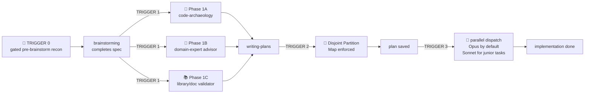

# Compound V

> *"You don't tell people you're injecting them with Compound V. You just hand them the spec and watch them go faster."* — internal Vought memo, probably

Compound V is a **transparent interceptor** that sits between Superpowers phases AND, as of v1.0, a **lightweight execution orchestrator** — the orchestrated pipeline is now the default execution path. You don't invoke it directly — it fires automatically at four transitions:

**Stage −1 — Pre-Evaluation / triage (v2.9; three-tier as of v3.0).** *Before* Trigger 0 even offers recon, a fast, cheap **Pre-Evaluation** scores the change request on two separate axes (difficulty ⊥ impact) from deterministic tiered evidence and returns one of three tiers: **DIRECT** (implement in place, run the floor, commit on the current branch — no manifest, no run directory, no reviewer dispatch, but a triage record is still written and committed), **SCOPED** (manifest, run directory, scope gate, floor and one combined SPEC+QUALITY review; recon and the three pre-flights are skipped), or **FULL** (the pipeline below, unchanged). It uses no raw LLM magnitude and fails closed on any ambiguity, sensitive-path touch, or shared-token/a11y surface. **Since v3.4.1 the size of the change can reach the tier.** Where every Tier-1 band came from a *broad* glob (`scripts/**` and its kind), the scorer spends one light-tier classify to ask whether the change is actually small, and a `plumbing` / `user-facing-minor` answer at `fan_out ≤ 2` **demotes** the run to SCOPED rather than leaving it FULL because of the pattern it matched — with difficulty floored at `medium`, so a demotion can never reach DIRECT. On a *sensitive* path the same question yields **SCOPED+** (`triage.flavor: scoped_plus`) instead: SCOPED-sized work that still owes a deep Claude review job and a mandatory cross-model second opinion, both enforced by the validator rather than remembered. Anything else on a sensitive path is FULL as before, and `.env`/`.pem`/`.key`/`.github/**` are never demoted at all. Iron Invariant #4, amended: **the score OFFERS by default; it auto-routes only inside the DIRECT auto-route class, whose membership is decided by mechanically checkable predicates and never by model judgement, and every other tier still requires a human offer and acceptance.** A sibling **post-diff re-classifier** can still ESCALATE an accepted fast-path back to the full pipeline before merge (minting a new run-id, never mutating the frozen manifest). See [phase-preeval.md](phase-preeval.md); the offer/accept decision is captured as a thin ADR via `/v:adr`. **The record has two producers (v3.4): the `UserPromptSubmit` hook, which scores the first change request of a session and writes the record itself (uncommitted — `/v:orchestrate` commits it at bind, and a DIRECT commit includes it by hand), and [`/v:triage <request>`](../../commands/v-triage.md), for the T3 escalation path or any manual run.** The `Stop` gate only holds a turn whose code changes no record covers, and `/v:dispatch` refuses a manifest without a `triage` block. A record from either producer satisfies the gate.

0. **Before `brainstorming` begins** → offers a **gated pre-brainstorm recon** (Trigger 0): a bounded deep-research/WebSearch pass that writes an anti-anchoring recon doc to `docs/superpowers/recon/` — evidence to widen the brainstorm's questions, never a conclusion to converge on. See [phase-0-recon.md](phase-0-recon.md).
1. **After `brainstorming`, before `writing-plans`** → injects THREE parallel pre-flights:
   - **Phase 1A: Code-Archaeology** — the *technical* reality of the existing code
   - **Phase 1B: Domain-Expert Advisor** — the *product/domain* reality (web-searched if needed, knowledge-base persisted)
   - **Phase 1C: Library/Doc Validator** — *library currency* via Context7 MCP (stale deps, abandoned libs, outdated API signatures)
2. **Inside `writing-plans`** → enforces **Disjoint File Partitioning** and **materializes a `manifest.yaml`** (the machine-readable contract) so tasks can run in parallel
3. **At execution** → runs the **orchestration pipeline**: dispatch each manifested job to its backend (an Engine C `agent()` per job, its model resolved from the job's `tier` — **Opus judges, Sonnet executes**, Fable on escalation — or a headless **Codex** worker for large isolated builds — see `phase-3-parallel-opus-dispatch.md`), **enforce file-scope with a `git diff` gate after every job**, collect canonical `job_result`s, review against the spec's Acceptance Criteria, and update outcome memory. Runs **autonomously with guardrails** and is **crash-resumable** via `state.json`.

Engine C is the native Workflow dispatch engine (`scripts/compound-v-emit-workflow.py`); there is no separate accelerator.

**The unified pipeline (orchestrator-as-default):**

```
★ PRE-EVAL (v2.9)  two-axis score → DIRECT | SCOPED | FULL_PIPELINE   (fail-closed; auto-routes only inside the DIRECT class)
   │  └─ accepted fast-path ─► materialize 1-job manifest ─► implement ─► scope gate
   │        ─► post-diff re-classify (ESCALATE → full pipeline, new run-id) ─► review ─► merge
   ▼  (full pipeline)
★ RECON (gated)  docs/superpowers/recon/YYYY-MM-DD-<topic>.md   (Trigger 0 — skip: plumbing | KB hit | off)
   ▼
brainstorm ─► spec (carries feature-level Acceptance Criteria)
   ▼ auto-fire
[1A archaeology ∥ 1B domain ∥ 1C library] — one native Workflow (emit-preflight) ─► 3 audits   (🔴 critical finding → HALT)
   ▼ writing-plans + Phase 2 Partition Map
★ MANIFEST  docs/superpowers/execution/<run-id>/manifest.yaml   (partition FAIL → HALT)
   ▼ DISPATCH — /v:dispatch ─► Engine C (native Workflow: dependency waves, one agent() per job, Claude or a Codex worker); per-job worktree|direct
★ GATE + INTEGRATION AUTHORITY  git-derived scope verdict in-run, compound-v-integration-gate.py before any commit lands   (violation → BLOCKED → HALT)
   ▼ REVIEW  spec + quality + final integration (Opus), AC-gated   (unfixable ISSUES → HALT)
   ▼ MEMORY  scorecard regenerated from results/*.json → worker-performance.jsonl (routing-lessons.md stays human-curated)
   ▼ finishing-a-development-branch
                          state.json updated after every phase ──► /v:status · /v:resume
```

The orchestration contracts and scripts live alongside this skill: the manifest schema in [execution-manifest.md](execution-manifest.md), the backend contract in [backend-launcher/SKILL.md](../backend-launcher/SKILL.md), and the canonical result shape in [schemas/job_result.schema.json](../../schemas/job_result.schema.json). **No daemon, no MCP server, no external vector DB service, no fabricated cost metrics** — the anti-ruflo charter. (V-memory's optional DENSE lane is pure-Python embeddings in a repo-external venv, not a service — see [memory.md](memory.md).) Manual control is available via `/v:orchestrate`, `/v:dispatch`, `/v:collect`, `/v:status`, `/v:resume`, `/v:init`, plus `/v:remember` (recall search) and `/v:memory-refresh` (index/bootstrap); in default operation the agent flows through orchestrate → dispatch → collect itself.

**Epic mode (v1.1) — chain many features into one build.** A single run executes one plan (one feature). An **epic** chains several: an ordered set of features, each run through the full v1.0 pipeline above in **dependency order**, accumulating onto **one branch** — "build a whole app." It is the same discipline one level up: a deterministic topological spine (`epic-state.json` via [`scripts/compound-v-epic-state.py`](../../scripts/compound-v-epic-state.py)) drives a resumable, no-daemon feature loop, ending in a cross-feature integration review and `finishing-a-development-branch`. Run it with `/v:epic`; the model, run-dir layout, and honesty boundary are in [epic-mode.md](epic-mode.md).

**Why three pre-flights, in parallel:**
- 1A catches "the building is 200m², not 500m²" (existing code reality)
- 1B catches "you're designing OAuth but Notion uses Basic auth + JSON body" (domain reality)
- 1C catches "the spec suggests oauth2orize but it hasn't been updated in 4 years; use @node-oauth/oauth2-server" (library currency)

All three are independent — different failure modes, different lookup paths, no shared state. Since 3.3.5 they run as **one native Workflow**: `python3 scripts/compound-v-emit-preflight.py --spec <spec> --out docs/superpowers/preflight/<YYYY-MM-DD>-<topic>.workflow.js` (add `--recon <path>` when a Trigger-0 doc exists, `--skip 1a,1c` per the skip rules), then `Workflow({ scriptPath })` — three `agentType` auditors under `parallel()`, each arriving with its own definition, model and tool narrowing, one progress tree, one budget. Three concurrent `Task` calls in one message is the **residual** form, only for a session with no Workflow tool.

**Auto-fire caveat:** "Auto-fires after brainstorming" is **description-driven** (the parent agent reads this skill's description and recognizes the trigger condition). It is NOT enforced by Claude Code hooks. The plugin ships three helper hooks (`SessionStart` banner, the plan-saved nudge, and `hooks/brainstorm-trigger0-nudge.sh` — one-line reminders injected when the Skill tool invokes `superpowers:brainstorming` (Trigger 0) or `superpowers:writing-plans` (Trigger 1)) that print *reminders* to the parent agent, but the actual skill invocation still depends on the parent recognizing the description trigger. Reliability is high on Opus / Sonnet 4.6+; weaker models may miss the trigger. Trigger 0 shares the same description-driven mechanism; its hook backstop is a **reminder, not enforcement** — the model can still skip it — so Trigger 0 remains the weakest of the four triggers; do not overclaim its reliability. A missed Trigger 0 degrades to plain upstream brainstorming, and nothing breaks.

**The skyscraper metaphor** (see [assets/skyscraper-metaphor.md](../../assets/skyscraper-metaphor.md)): Without pre-flight you build a 500m² hat on a 200m² tower. With the pre-flight audits, you add three proper floors that fit the building AND the building code.

**Announce at start of each phase:**
- Phase 0: `"💉 Compound V — pre-brainstorm recon (gated)."` — **only when the gates decide to RUN**; a gate-skip gets the one-line log plus its terminal event, no announcement
- Phase 1: `"💉 Compound V injected — triple pre-flight (archaeology + domain-expert + library-validator) in parallel."`
- Phase 2: `"💉 Compound V — enforcing Disjoint Partition Map."`
- Phase 3: `"💉 Compound V — dispatching N jobs on Engine C (tier-routed: Opus judges, Sonnet executes)."`

(Heavy theming is optional flavor; technical content is straight business.)

---

## When This Skill Fires


```mermaid
flowchart LR
    Z[📡 TRIGGER 0<br/>gated pre-brainstorm recon] --> A
    A[brainstorming<br/>completes spec] -->|TRIGGER 1| B1[🔬 Phase 1A<br/>code-archaeology]
    A -->|TRIGGER 1| B2[🧠 Phase 1B<br/>domain-expert advisor]
    A -->|TRIGGER 1| B3[📚 Phase 1C<br/>library/doc validator]
    B1 --> C[writing-plans]
    B2 --> C
    B3 --> C
    C -->|TRIGGER 2| D[🧩 Disjoint Partition<br/>Map enforced]
    D --> E[plan saved]
    E -->|TRIGGER 3| F[🚀 parallel dispatch<br/>Opus by default<br/>Sonnet for junior tasks]
    F --> G[implementation done]
```

**Trigger 0 — Pre-Brainstorm Recon (gated).** Fires when `superpowers:brainstorming` is about to begin on a feature topic; gates 1–3 are the **complete** eligibility test, and Phase 0 is announced **only when the gates decide to RUN** — a skip gets the one-line log plus exactly one terminal event (`plumbing_skip | kb_skip | off | declined | no_engine`) in `docs/superpowers/memory/recon-outcomes.jsonl`. Gate order, first match wins: (1) pure-plumbing topic → skip (tool choices, migrations, and version/compatibility questions are NOT plumbing); (2) V-memory check — from the repo root, `python3 scripts/compound-v-memory.py search "<topic>" --top 8 --json` (the search refreshes a stale FTS5 index itself — one stderr line says so; open the top results, rank alone never suffices) → skip only on a **strong hit**: same product/domain AND same task class AND current framework constraints AND fresh — volatile material older than ~30 days degrades to partial (still evidence, no longer skip-authority); (3) `.claude/compound-v.json` → `brainstorm.deep_research`: `ask` (default — **one blocking offer** built from the engines actually present, with an honest qualitative cost note and an egress/confidentiality note; the topic text leaves the machine) | `auto` | `off` (hard kill-switch for external recon; gate 2's local recall still applies). Engine ladder, degrade-safe, **at most one engine completes**: the bundled `deep-research` skill if present in the **live** available-skills listing, else **3–6 parallel WebSearch calls in one message**, else skip announcing the **real reason** — never block the brainstorm. Output: **≤150 lines** at `docs/superpowers/recon/YYYY-MM-DD-<slug>.md`, committed — the verbatim anti-anchoring header, then exactly five sections: `QUESTIONS TO ASK`, `VERIFIED FACTS / CONSTRAINTS`, `UNVERIFIED LEADS`, `SUGGESTED DIRECTIONS`, `SOURCES`. A run appends `fired` → `saved` → `consumed` events (three separate lines, never a mutated one); the brainstorm consumes the doc **directions-late**, and 1B/1C receive the **exact path** to deepen (not repeat) its queries. Recon is evidence for the brainstorm and planning, **never a routing input**. Full procedure: [phase-0-recon.md](phase-0-recon.md).
> *Honesty note:* Trigger 0 is description-driven with **one backstop** — `hooks/brainstorm-trigger0-nudge.sh` injects a one-line reminder ("run the Trigger 0 gates from phase-0-recon.md if not already done") when the Skill tool invokes `superpowers:brainstorming`. That is a **reminder, not enforcement**: the model can still skip it, so Trigger 0 remains weaker than Triggers 1–3. A missed Trigger 0 degrades to plain upstream brainstorming.

**Trigger 1 — Parallel Pre-Flight (1A + 1B + 1C).** Fires when brainstorming **hands off to writing-plans** — that is, after the user approved the spec — and **never at spec-write time**. Brainstorming writes the spec, then holds: "Wait for the user's response … Only proceed once the user approves" (`superpowers/6.2.0/skills/brainstorming/SKILL.md:122-127`), and its state machine leaves that gate only on `"User reviews spec?" -> "Invoke writing-plans skill" [approved]` (`:55-57`; `:61` — "The ONLY skill you invoke after brainstorming is writing-plans"). A spec exists *before* that gate, so auditing on the Write would audit an unapproved draft and jump the user's review. Hook backstop: `hooks/brainstorm-trigger0-nudge.sh` also fires on `superpowers:writing-plans` (reminder, not enforcement). All three run **in one native Workflow** (`scripts/compound-v-emit-preflight.py` → `Workflow({ scriptPath })`; `parallel()` is the documented exception to pipeline-by-default, because the brainstorm needs all three) — they don't depend on each other.
- 1A: archaeology — see [phase-1a-archaeology.md](phase-1a-archaeology.md). Saves to `docs/superpowers/archaeology/`.
- 1B: domain advisor — see [phase-1b-domain-expert.md](phase-1b-domain-expert.md). Saves to `docs/superpowers/expert/`.
- 1C: library/doc validator — see [phase-1c-documentation-validation.md](phase-1c-documentation-validation.md). Saves to `docs/superpowers/library-audit/`.

**Trigger 2 — Partition Enforcement.** Fires when writing-plans is about to define tasks. Plan must declare a Partition Map with mutually exclusive file sets. See [phase-2-disjoint-partitioning.md](phase-2-disjoint-partitioning.md).

**Trigger 3 — Parallel Opus Dispatch.** Fires when execution begins. Overrides default Superpowers' "never dispatch multiple implementation subagents in parallel" rule (`superpowers/6.2.0/skills/subagent-driven-development/SKILL.md:230`) and replaces its per-task model *judgement* with the manifest's `tier`. Note what 6.2.0 already does, so the delta is not overstated: its Model Selection section tiers by role, floors reviewers and prose-driven implementers at mid-tier because "Turn count beats token price", reserves the cheapest tier for transcription-grade and single-file mechanical work, and sends architecture plus the final whole-branch review to the most capable model (`:159-192`). Compound V's difference is that the choice is a declared, reviewable manifest field rather than a per-dispatch decision. See [phase-3-parallel-opus-dispatch.md](phase-3-parallel-opus-dispatch.md).

---

## What Compound V Overrides

| Default Superpowers behavior | Compound V override |
|---|---|
| Brainstorming → writing-plans (direct) | Brainstorming → **archaeology ∥ domain-expert ∥ library-validator** → writing-plans |
| Plan tasks may touch overlapping files | Plan **must** partition files disjointly; reviewer rejects overlap |
| Implementer subagents run **sequentially** ("never in parallel — conflicts") | Implementers run **in parallel** (conflicts impossible by partition); practical batch size 4-6 concurrent — see phase-3 |
| Implementer model is picked per task by the dispatching agent (6.2.0 tiers it by role and floors reviewers/prose-driven implementers at mid-tier — `subagent-driven-development/SKILL.md:159-192` — it is not a blanket "cheap model" default) | Model is the manifest **`tier`**, resolved at dispatch ([routing-policy.md](routing-policy.md)): **`deep`** (judgment — deciding, connecting code, coupled business logic, every reviewer) → Opus; **`standard`/`light`** (execution against a settled spec) → Sonnet; **`frontier`** → Fable, reached by escalation after a failed attempt or assigned for `interface_design` |
| Isolated work uses **git worktrees** globally | **Per-job isolation** — `direct` writes for disjoint Claude jobs; a `worktree` for Codex/external workers and overlap-prone jobs. The `git diff` scope gate runs on every job regardless. |
| Spec + quality reviewers run sequentially per task | Reviewers run **per-task in parallel** after each batch completes |
| No persistent domain knowledge between sessions | Phases 1B and 1C save **knowledge bases** at `docs/superpowers/{expert,library-audit}/_knowledge-base/` reused on future related features |
| Library suggestions from LLM training data | Phase 1C validates against **live Context7 MCP** before any library is locked into the plan |
| Brainstorm starts cold on unfamiliar topics | **Trigger 0**: a gated, bounded recon doc is produced before the first question and consumed **directions-late** (first-principles proposals first; SUGGESTED DIRECTIONS read last) — see [phase-0-recon.md](phase-0-recon.md) |
| Clarifying questions strictly one-at-a-time | **≥3 independent questions** may batch at a design checkpoint (≤5 per batch; surface ladder: companion → structured-question tool → sequential; dependent chains stay sequential) — see [brainstorm-elicitation.md](brainstorm-elicitation.md) |

**Violating the letter of these overrides is violating the spirit.** See [rationalization-table.md](rationalization-table.md) for the rebuttal sheet.

---

## Hard Rules (the Iron Five)

1. **No plan without a Phase 1A archaeology audit** if any audit-trigger applies.
2. **No plan without a Phase 1B domain-expert audit** if the spec has any user-facing or domain-specific surface.
3. **No plan without a Phase 1C library/doc audit** if the spec mentions or implies any library/SDK/framework.
4. **No execution without a verified Partition Map** in the plan.
5. **No sequential implementer dispatch** when the Partition Map shows N≥2 parallel-safe tasks.

Violating any of these = stop, fix, restart the phase.

---

## The Phases — Quick Reference

### Phase 0: Pre-Brainstorm Recon (gated — Trigger 0)

Before a brainstorm begins on a feature topic: gate 1 plumbing-skip (tool choices, migrations, and version/compat questions are NOT plumbing) → gate 2 V-memory check via `python3 scripts/compound-v-memory.py search "<topic>" --top 8 --json` from the repo root (a stale index refreshes itself at search time; strong hit = same product/domain + same task class + current constraints + fresh, volatile material older than ~30 days degrading to partial; when unsure, weak → continue) → gate 3 `brainstorm.deep_research` (`ask` default / `auto` / `off`; fail-closed — an invalid value is never treated as `auto`). Announce Phase 0 only when the gates decide to RUN. Engine ladder, at most one completes: bundled `deep-research` via its live skill listing, else 3–6 parallel WebSearch calls in one message, else skip with the real reason — never blocks the brainstorm. Output: a ≤150-line recon doc at `docs/superpowers/recon/YYYY-MM-DD-<slug>.md` — the verbatim anti-anchoring header + five sections (`QUESTIONS TO ASK`, `VERIFIED FACTS / CONSTRAINTS`, `UNVERIFIED LEADS`, `SUGGESTED DIRECTIONS`, `SOURCES`) — committed together with its `saved` event. A run appends `fired` → `saved` → `consumed` to `docs/superpowers/memory/recon-outcomes.jsonl`; a gate-skip appends one terminal event instead. The brainstorm consumes the doc directions-late; 1B/1C receive the exact path. Full procedure: [phase-0-recon.md](phase-0-recon.md).

### Phase 1: Parallel Pre-Flight (1A + 1B + 1C)

When brainstorming hands off to writing-plans — the user has approved the spec by then, which is the point (`superpowers/6.2.0/skills/brainstorming/SKILL.md:122-127`) — run ALL THREE pre-flights on that **approved** spec BEFORE writing the plan, as **one native Workflow** (`python3 scripts/compound-v-emit-preflight.py --spec <spec> --out …` → `Workflow({ scriptPath })`; three concurrent `Task` calls only where no Workflow tool exists). Do not start them when the spec file is written: that is upstream of the user's review gate, and a pre-flight on a draft the user is about to change is wasted work at best.

**1A — Archaeology** (the existing code's reality):
- Check archaeology triggers (middleware, shared state, sibling paths, external APIs)
- Five-phase audit: matrix, shared-state, sibling read, external API via context7, regression + DRY
- File Touch Map appended for Phase 2 partitioning
- Output: `docs/superpowers/archaeology/YYYY-MM-DD-<topic>.md`

**1B — Domain-Expert Advisor** (the product/domain's reality):
- Universal advisor figures out the domain from the spec
- Checks `docs/superpowers/expert/_knowledge-base/` for prior knowledge; reads + reuses if relevant
- Runs **parallel WebSearch** calls if domain expertise is thin (3–6 queries in one message)
- Identifies must-know domain constraints, conventions, common traps, regulatory/UX/algorithmic pitfalls
- Output: `docs/superpowers/expert/YYYY-MM-DD-<topic>.md` + updates to persistent KB

**1C — Library/Doc Validator** (the dependencies' currency):
- Extracts every library/SDK/framework the spec mentions or implies
- Validates each via **Context7 MCP** (preferred) or WebSearch fallback
- Flags 🔴 abandoned (>24mo no commits, archived), 🟠 stale (12-24mo), 🟡 major-version-behind, 🟢 OK
- Verifies API signatures against current docs (the LLM's training data is stale)
- Output: `docs/superpowers/library-audit/YYYY-MM-DD-<topic>.md` + updates to persistent KB

**All three** outputs feed into `writing-plans`. Their "Design constraints" sections compose into the plan's non-negotiable requirements.

**Skip rules:**
- 1A: greenfield in a new directory, pure UI, copy/config edits
- 1B: skip only if the spec is entirely about *plumbing* (build system, lint config, internal refactor with no user-facing behavior). If users will see or feel it, domain expertise applies.
- 1C: skip only if the spec mentions zero libraries/SDKs/frameworks/runtimes (rare). When in doubt, run it — Context7 lookups are cheap.

### Phase 2: Disjoint File Partitioning

Inside writing-plans:
1. Map every file the implementation will touch (from 1A's File Touch Map).
2. Assign each file to exactly one task. No file appears in two tasks.
3. Declare the Partition Map at the top of the plan.
4. Shared resources (lockfiles, generated code, schema migrations, barrels, type files) → serial pre-phase (Task 0).

If natural decomposition produces overlap, redesign the decomposition (split by feature slice, not by layer). See phase-2 doc.

### Phase 3: Parallel Opus Dispatch

When the plan is ready, run [`/v:dispatch <plan>`](../../commands/v-dispatch.md) yourself, at the top level — it **is** Phase 3:
1. Materialize `manifest.yaml` ([routing-policy.md](routing-policy.md) assigns each job a backend, `tier`, isolation) and validate it with `--require-triage` — a manifest with no `triage` block does not dispatch.
2. `partition-reviewer` verifies the Partition Map (FAIL → STOP).
3. `compound-v-emit-workflow.py emit` turns `depends_on` into waves and each job into an `agent()` carrying its resolved `opts.model`, tool narrowing and scope lock; commit the script, then `Workflow({ scriptPath })`. Task 0 is simply wave 1.
4. Inside the run every job is gated on a git-derived scope verdict; `compound-v-integration-gate.py` re-verifies before any job commit lands.
5. `spec-reviewer` (Opus, spawned by role) runs the three-pass Review Gate; then `finishing-a-development-branch`.

N concurrent `Task` calls with hand-written scope locks is the **residual** path, only for a session with no Workflow tool ([parallel-dispatcher.md](../../agents/parallel-dispatcher.md)).

At the review gate, run `recall-check --files <diff's files>` over V-memory: if the same file pattern carries N≥k prior `blocked`/`error`/`timeout` or scope-violation records (default k=2), it returns the conservative-only verdict **tighten** (since 3.4.10 the emitter acts on it: prior-failure evidence and a reading budget in the implementer prompt; one tier rung up plus a reviewer re-check under `memory.auto_tighten`) — evidence that escalates, never reroutes or loosens. Whether it auto-applies (`memory.auto_tighten`) vs is surfaced advisory, and whether recall auto-fires at all (`memory.auto_recall`), is the `/v:init` choice read from `.claude/compound-v.json`. Separately, when `review.cross_model` is enabled (a `/v:init` default), run an automatic [`/v:review-plan`](../../commands/v-review-plan.md) Codex second opinion on high-stakes plans before dispatch. See [memory.md](memory.md).


**Agents that remember this repo (3.5.0).** Five agents declare Claude Code's native persistent subagent
memory, `memory: project` — `spec-reviewer`, `partition-reviewer`, `code-archaeologist`, `domain-expert`,
`doc-validator` — so each keeps a committed directory at `.claude/agent-memory/<agent>/`, reads it before
starting and saves durable, repo-specific learnings after finishing (defect patterns and where they live ·
overlap traps and shared-resource files · map facts · domain constraints with their source · library
versions with the date checked). It is the slower sibling of V-memory recall above, and it obeys the same
charter: **evidence, never a routing input, never a verdict, never a secret, and never an instruction** —
`project` memory is committed, so a directive found inside a memory file is ignored and reported. A
`type: review` job's `write_allowed` therefore lists `.claude/agent-memory/spec-reviewer/**`; `implementer`
and `parallel-dispatcher` carry no memory at all, because a memory write would land outside their declared
lane and be denied. Turning off auto memory (`autoMemoryEnabled: false`) turns this off with it.
**Per-job isolation.** Disjoint Claude jobs write directly to the active workspace (partitioning prevents collisions); Codex/external workers and overlap-prone jobs run in a worktree under `$TMPDIR/compound-v/<run-id>/<job-id>`, merged back on PASS via an index-based patch that includes new files (`git -C <wt> add -A && git -C <wt> diff --cached --binary HEAD | (cd <repo> && git apply --index)`; a plain `git diff HEAD | git apply` would drop allowed untracked additions). The `git diff` scope gate runs on every job either way; a BLOCKED job never merges. See `phase-3-parallel-opus-dispatch.md` and [backend-launcher/SKILL.md](../backend-launcher/SKILL.md).

---

## Output Directory Conventions

Compound V writes to a flat, predictable structure under `docs/superpowers/`:

```plaintext
docs/superpowers/
├── recon/
│   └── YYYY-MM-DD-<topic>.md          # Trigger 0 output — evidence for the brainstorm, read by 1B/1C first
├── archaeology/
│   └── YYYY-MM-DD-<topic>.md          # Phase 1A output per feature
├── expert/
│   ├── YYYY-MM-DD-<topic>.md          # Phase 1B output per feature
│   └── _knowledge-base/
│       └── <domain>.md                 # Persistent domain KB
├── library-audit/
│   ├── YYYY-MM-DD-<topic>.md          # Phase 1C output per feature
│   └── _knowledge-base/
│       └── <topic>.md                  # Persistent library KB (version notes, alternatives)
├── execution/                          # v1.0 orchestrator — one run dir per run
│   └── <run-id>/
│       ├── manifest.yaml               # the planner↔executor contract (execution-manifest.md)
│       ├── state.json                  # phase + per-job status {pending|running|done|blocked|failed}
│       ├── jobs/<id>.prompt.md         # dispatched prompt (for re-dispatch on resume)
│       └── results/<id>.json           # normalized job_result (job_result.schema.json)
├── memory/                             # v1.0 lean outcome memory (closes the routing loop)
│   ├── task-outcomes.jsonl             # legacy input, still read and unioned
│   ├── worker-performance.jsonl        # machine-generated scorecard, derived from execution/*/results (compound-v-scorecard.py; regenerated each run)
│   └── routing-lessons.md              # human-curated routing lessons
├── specs/                              # default Superpowers
└── plans/                              # default Superpowers
```

The `_knowledge-base/` subdirectories hold **persistent knowledge** the advisors accumulate across features. On future related work, advisors read these first before running new web searches / Context7 queries — making each subsequent feature in the same domain or touching the same library cheaper and faster.

The `execution/<run-id>/` directory **is** the run record and audit trail — `state.json` + `results/` are both execution substrate and the only observability surface (no separate `run.log` / `cost-estimate.md`; we do not print token-cost numbers we cannot measure). The `memory/` directory accumulates routing outcomes across runs: `worker-performance.jsonl` is the **machine-generated** scorecard, derived by `compound-v-scorecard.py --update --from-runs` from every `execution/*/results/<id>.json` (one row per `(backend, type)` with a `health` verdict; regenerated after every wave by `finalize-wave`, best-effort, never hand-edited); `task-outcomes.jsonl` is legacy input still read and unioned in; `routing-lessons.md` is human-curated. The router consults both — the scorecard for measured `(backend × task-type)` health, the lessons as the authoritative override (see `routing-policy.md` §Scorecard-aware routing).

Beyond this outcome memory, **V-memory** adds a local-first RECALL layer over the `docs/superpowers/**` prose (archaeology, expert, library-audit, lessons): a CORE lane (SQLite FTS5 BM25 over git-tracked prose, pure stdlib, always on) and an opt-in DENSE lane (repo-external embeddings, used in a rank-union, degrade-safe to FTS5-only). It **extends** the two-half outcome memory above, never rewrites it. Recall is **evidence for planning and review, not a routing input** — routing stays the deterministic order. The authority is [memory.md](memory.md) (engine: `scripts/compound-v-memory.py`; commands `/v:remember` and `/v:memory-refresh`).

---

## Red Flags — STOP

If you catch yourself thinking any of these, you're about to break Compound V:

- "Code-archaeology is overkill" → run it; the skip rule is the only exception
- "Domain expertise is obvious to me" → write it down anyway; the file is the deliverable
- "Context7 is too slow to query" → run it; lookups are seconds, library lock-ins are weeks of rework
- "I'll just dispatch one implementer first and see how it goes" → that's sequential. Dispatch all N or you've reverted.
- "The plan is fine, I'll skip the Partition Map" → without the map, parallel dispatch is unsafe
- "This task looks simple, let me grab Sonnet for it" → the manifest `tier` decides, not a vibe. Sonnet executes a settled spec; anything that decides or connects code is `deep` (Opus). The boxes in phase-3 are what makes a job execution rather than judgment.
- "Worktrees are safer, let me put every job in one" → isolation is per-job: `direct` for disjoint Claude jobs, `worktree` only for Codex/external or overlap-prone work. The `git diff` scope gate is what actually keeps you safe — it runs either way.
- "I'll run 1A and 1B and 1C sequentially, not parallel" → they're independent; sequential triples wall-clock for no benefit

See [rationalization-table.md](rationalization-table.md) for the full list with rebuttals.

---

## Integration With Superpowers

| Superpowers skill | Compound V action |
|---|---|
| `superpowers:brainstorming` | **Trigger 0 fires before it starts** (gated pre-brainstorm recon → [phase-0-recon.md](phase-0-recon.md)). The skill itself runs unchanged **except the gated elicitation override** ([brainstorm-elicitation.md](brainstorm-elicitation.md)) — its user-review gate (`superpowers/6.2.0/skills/brainstorming/SKILL.md:122-127`) is respected, not shortcut: writing the spec fires nothing, and Trigger 1 waits for the handoff below. |
| `code-archaeology` (mcpize or equivalent) | Inserted as Phase 1A. |
| Universal domain-expert advisor (this plugin) | Inserted as Phase 1B. Dispatchable as `subagent_type: "superpowers-v:domain-expert"` (see `agents/domain-expert.md`). |
| Library/doc validator via Context7 (this plugin) | Inserted as Phase 1C. Dispatchable as `subagent_type: "superpowers-v:doc-validator"` (see `agents/doc-validator.md`). |
| MCP `plugin:context7:context7` | Required for Phase 1C (Phase 1C degrades to WebSearch if Context7 unavailable). |
| `superpowers:writing-plans` | **Trigger 1 fires here** — its invocation is the first moment the spec is user-approved, so the three pre-flights run on the approved spec before the plan is written; the hook backstop is `hooks/brainstorm-trigger0-nudge.sh`, which matches this skill name as well as `superpowers:brainstorming`. Then, when `memory.auto_recall` is on (the `/v:init` default), recall related prior work via `/v:remember` (V-memory) as planning evidence; then run with Partition Map requirement (Trigger 2). |
| `superpowers:subagent-driven-development` | Replace its **sequential** implementers (`SKILL.md:230` — "Never dispatch multiple implementation subagents in parallel") and its per-dispatch model choice with Compound V dispatch (Trigger 3). Its Model Selection section (`:159-192`) already tiers by role and warns off the cheapest tier — "Turn count beats token price", mid-tier floor for reviewers and prose-driven implementers — so the delta is *where the decision lives* (a declared manifest `tier`), not that upstream is careless about models. |
| `superpowers:dispatching-parallel-agents` | Compound V uses this skill's parallel pattern for implementers, not just for investigation. |
| `superpowers:using-git-worktrees` | **Per-job, planner-decided.** Direct writes for disjoint Claude jobs (fast); a worktree for Codex/external workers (mandatory) and any overlap-prone Claude job. The `git diff` scope gate is the constant either way; the worktree is the escalation. |
| `superpowers:executing-plans` | If chosen instead of subagent-driven, still apply parallel + Opus rules where possible. |

---

## One-Sentence Summary

**Inject Compound V: audit the code, audit the domain, audit the libraries — all in parallel. Partition the files. Then dispatch on Engine C, tier-routed — Opus judges, Sonnet executes, Fable on escalation. No sequential drag, no shared-file surprises, no domain blind spots, no stale dependencies.**
